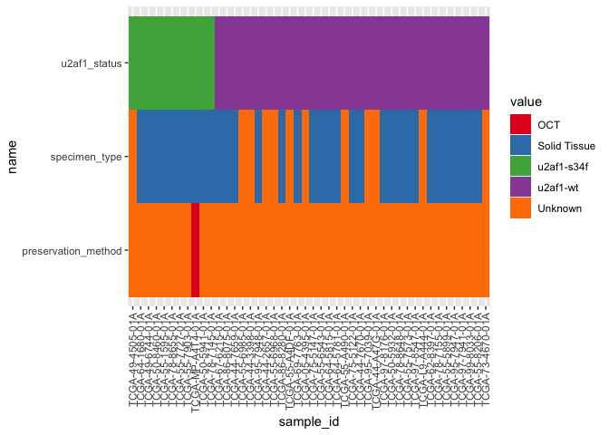

# 2025.09.17 characterize 46 sample cohort
Holly Beale
2025-09-17

``` r
library(tidyverse)
```

    Warning: package 'readr' was built under R version 4.2.3

    Warning: package 'dplyr' was built under R version 4.2.3

    ── Attaching core tidyverse packages ──────────────────────── tidyverse 2.0.0 ──
    ✔ dplyr     1.1.4     ✔ readr     2.1.5
    ✔ forcats   1.0.0     ✔ stringr   1.5.0
    ✔ ggplot2   3.4.4     ✔ tibble    3.2.1
    ✔ lubridate 1.9.4     ✔ tidyr     1.3.1
    ✔ purrr     1.0.2     
    ── Conflicts ────────────────────────────────────────── tidyverse_conflicts() ──
    ✖ dplyr::filter() masks stats::filter()
    ✖ dplyr::lag()    masks stats::lag()
    ℹ Use the conflicted package (<http://conflicted.r-lib.org/>) to force all conflicts to become errors

``` r
library(janitor)
```


    Attaching package: 'janitor'

    The following objects are masked from 'package:stats':

        chisq.test, fisher.test

``` r
library(here)
```

    here() starts at /Users/hbeale/Documents/Dropbox/ucsc/projects/gitCode/splicedice_analysis

``` r
this_manifest_file <- here("2025-05_tcga_luad_download/batch_2_bam_manifest.with_genotypes.2025.09.10_10.03.13.tsv")

manifest <- 
  read_tsv(this_manifest_file,
           col_names = c("sample_name",
                         "bam_file_path",
                         "id1",
                         "id2")) %>%
  mutate(file_name = str_remove(bam_file_path, "^.*/"))
```

    Rows: 46 Columns: 4
    ── Column specification ────────────────────────────────────────────────────────
    Delimiter: "\t"
    chr (4): sample_name, bam_file_path, id1, id2

    ℹ Use `spec()` to retrieve the full column specification for this data.
    ℹ Specify the column types or set `show_col_types = FALSE` to quiet this message.

check features

``` r
gdc_sample_sheet <- read_tsv(here("2025-05_tcga_luad_sig_from_bam/gdc_sample_sheet.2025-05-22.tsv"))
```

    Rows: 541 Columns: 11
    ── Column specification ────────────────────────────────────────────────────────
    Delimiter: "\t"
    chr (11): File ID, File Name, Data Category, Data Type, Project ID, Case ID,...

    ℹ Use `spec()` to retrieve the full column specification for this data.
    ℹ Specify the column types or set `show_col_types = FALSE` to quiet this message.

``` r
lc_no_space <- function(x) str_replace_all(x, " ", "_") %>% tolower()
gdc_sample_sheet_renamed <- gdc_sample_sheet %>% rename_with(lc_no_space)
```

``` r
manifest_anno <- left_join(manifest,
          gdc_sample_sheet_renamed,
          by="file_name")

# batch_2_bam_manifest_with_gt_anno <- left_join(batch_2_bam_manifest_with_gt %>%
#                                                                   mutate(gdc_file_uuid = str_remove(sample_name, "^.*_")),
#           gdc_sample_sheet_renamed, by=c("gdc_file_uuid" = "file_id"))
```

# review sample features

``` r
n_unique <- function(x) length(unique(x))

unique_sample_vals <- manifest_anno %>%
#   mutate(across(everything(), as.character)) %>%
  ungroup %>%
  summarize(across(everything(),  n_unique)) %>%
  pivot_longer(everything())

unique_sample_vals
```

    Warning: 'xfun::attr()' is deprecated.
    Use 'xfun::attr2()' instead.
    See help("Deprecated")

| name                | value |
|:--------------------|------:|
| sample_name         |    46 |
| bam_file_path       |    46 |
| id1                 |     2 |
| id2                 |     2 |
| file_name           |    46 |
| file_id             |    46 |
| data_category       |     1 |
| data_type           |     1 |
| project_id          |     1 |
| case_id             |    46 |
| sample_id           |    46 |
| tissue_type         |     1 |
| tumor_descriptor    |     1 |
| specimen_type       |     2 |
| preservation_method |     2 |

# Features shared by all samples

``` r
manifest_anno %>%
  select(unique_sample_vals %>%
           filter(value == 1) %>%
           pull(name)) %>%
  distinct()
```

    Warning: 'xfun::attr()' is deprecated.
    Use 'xfun::attr2()' instead.
    See help("Deprecated")

| data_category    | data_type     | project_id | tissue_type | tumor_descriptor |
|:-----------------|:--------------|:-----------|:------------|:-----------------|
| Sequencing Reads | Aligned Reads | TCGA-LUAD  | Tumor       | Primary          |

# Features that differ

``` r
tabyl(manifest_anno,
      specimen_type)
```

    Warning: 'xfun::attr()' is deprecated.
    Use 'xfun::attr2()' instead.
    See help("Deprecated")

| specimen_type |   n |   percent |
|:--------------|----:|----------:|
| Solid Tissue  |  34 | 0.7391304 |
| Unknown       |  12 | 0.2608696 |

``` r
tabyl(manifest_anno,
      preservation_method)
```

    Warning: 'xfun::attr()' is deprecated.
    Use 'xfun::attr2()' instead.
    See help("Deprecated")

| preservation_method |   n |   percent |
|:--------------------|----:|----------:|
| OCT                 |   1 | 0.0217391 |
| Unknown             |  45 | 0.9782609 |

# Table of sample features

``` r
manifest_anno_for_display <- 
  manifest_anno %>%
  rename(u2af1_status = id1) %>%         
  arrange(u2af1_status) %>%
  mutate(sample_id = factor(sample_id, levels = unique(sample_id))) %>%
  select(sample_id, 
         u2af1_status,
         specimen_type,
         preservation_method)

manifest_anno_for_display
```

    Warning: 'xfun::attr()' is deprecated.
    Use 'xfun::attr2()' instead.
    See help("Deprecated")

| sample_id        | u2af1_status | specimen_type | preservation_method |
|:-----------------|:-------------|:--------------|:--------------------|
| TCGA-49-4505-01A | u2af1-s34f   | Unknown       | Unknown             |
| TCGA-64-1680-01A | u2af1-s34f   | Solid Tissue  | Unknown             |
| TCGA-49-6744-01A | u2af1-s34f   | Solid Tissue  | Unknown             |
| TCGA-50-8460-01A | u2af1-s34f   | Solid Tissue  | Unknown             |
| TCGA-55-1595-01A | u2af1-s34f   | Solid Tissue  | Unknown             |
| TCGA-78-8655-01A | u2af1-s34f   | Solid Tissue  | Unknown             |
| TCGA-55-7727-01A | u2af1-s34f   | Solid Tissue  | Unknown             |
| TCGA-55-7903-01A | u2af1-s34f   | Solid Tissue  | Unknown             |
| TCGA-MP-A4T4-01A | u2af1-s34f   | Solid Tissue  | OCT                 |
| TCGA-50-5941-01A | u2af1-s34f   | Solid Tissue  | Unknown             |
| TCGA-78-7145-01A | u2af1-s34f   | Solid Tissue  | Unknown             |
| TCGA-67-6215-01A | u2af1-wt     | Solid Tissue  | Unknown             |
| TCGA-86-8075-01A | u2af1-wt     | Solid Tissue  | Unknown             |
| TCGA-44-7659-01A | u2af1-wt     | Solid Tissue  | Unknown             |
| TCGA-55-6985-01A | u2af1-wt     | Unknown       | Unknown             |
| TCGA-44-3398-01A | u2af1-wt     | Unknown       | Unknown             |
| TCGA-95-7948-01A | u2af1-wt     | Solid Tissue  | Unknown             |
| TCGA-44-2657-01A | u2af1-wt     | Unknown       | Unknown             |
| TCGA-55-6968-01A | u2af1-wt     | Unknown       | Unknown             |
| TCGA-86-8280-01A | u2af1-wt     | Solid Tissue  | Unknown             |
| TCGA-55-A4DF-01A | u2af1-wt     | Unknown       | Unknown             |
| TCGA-69-7763-01A | u2af1-wt     | Solid Tissue  | Unknown             |
| TCGA-05-4395-01A | u2af1-wt     | Unknown       | Unknown             |
| TCGA-75-5147-01A | u2af1-wt     | Solid Tissue  | Unknown             |
| TCGA-55-6543-01A | u2af1-wt     | Solid Tissue  | Unknown             |
| TCGA-64-5815-01A | u2af1-wt     | Solid Tissue  | Unknown             |
| TCGA-64-5781-01A | u2af1-wt     | Solid Tissue  | Unknown             |
| TCGA-55-A490-01A | u2af1-wt     | Unknown       | Unknown             |
| TCGA-75-5122-01A | u2af1-wt     | Solid Tissue  | Unknown             |
| TCGA-44-7670-01A | u2af1-wt     | Solid Tissue  | Unknown             |
| TCGA-95-7039-01A | u2af1-wt     | Unknown       | Unknown             |
| TCGA-44-A47G-01A | u2af1-wt     | Unknown       | Unknown             |
| TCGA-97-8176-01A | u2af1-wt     | Solid Tissue  | Unknown             |
| TCGA-50-5932-01A | u2af1-wt     | Solid Tissue  | Unknown             |
| TCGA-78-8648-01A | u2af1-wt     | Solid Tissue  | Unknown             |
| TCGA-55-7573-01A | u2af1-wt     | Solid Tissue  | Unknown             |
| TCGA-97-8547-01A | u2af1-wt     | Solid Tissue  | Unknown             |
| TCGA-L9-A444-01A | u2af1-wt     | Unknown       | Unknown             |
| TCGA-62-8397-01A | u2af1-wt     | Solid Tissue  | Unknown             |
| TCGA-78-7155-01A | u2af1-wt     | Solid Tissue  | Unknown             |
| TCGA-55-5899-01A | u2af1-wt     | Solid Tissue  | Unknown             |
| TCGA-95-7947-01A | u2af1-wt     | Solid Tissue  | Unknown             |
| TCGA-97-7941-01A | u2af1-wt     | Solid Tissue  | Unknown             |
| TCGA-99-8033-01A | u2af1-wt     | Solid Tissue  | Unknown             |
| TCGA-55-8206-01A | u2af1-wt     | Solid Tissue  | Unknown             |
| TCGA-73-4670-01A | u2af1-wt     | Unknown       | Unknown             |

# Plot of sample features

``` r
 manifest_anno_for_display %>%
  pivot_longer(-sample_id) %>%
  ggplot(aes(x=sample_id, y=name, fill = value)) +
  geom_tile() +
  scale_fill_brewer(palette = "Set1")  +
  theme(axis.text.x = element_text(angle = 90, hjust = 1, vjust = 0.5))
```


