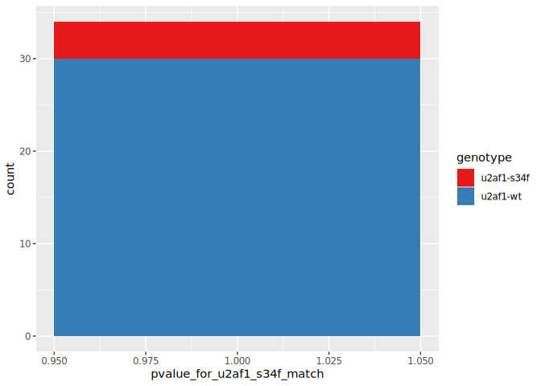

# split TCGA U2AF1 mut into test train.rmarkdown
Holly Beale
2025-06-04

``` r
library(tidyverse)
```

    ── Attaching core tidyverse packages ──────────────────────── tidyverse 2.0.0 ──
    ✔ dplyr     1.1.4     ✔ readr     2.1.5
    ✔ forcats   1.0.0     ✔ stringr   1.5.1
    ✔ ggplot2   3.5.1     ✔ tibble    3.2.1
    ✔ lubridate 1.9.4     ✔ tidyr     1.3.1
    ✔ purrr     1.0.2     
    ── Conflicts ────────────────────────────────────────── tidyverse_conflicts() ──
    ✖ dplyr::filter() masks stats::filter()
    ✖ dplyr::lag()    masks stats::lag()
    ℹ Use the conflicted package (<http://conflicted.r-lib.org/>) to force all conflicts to become errors

``` r
library(janitor)
```


    Attaching package: 'janitor'

    The following objects are masked from 'package:stats':

        chisq.test, fisher.test

# Load previous manifest

``` r
all_93_samples_sig_manifest <- 
read_tsv("/mnt/data/manifests/batches_1_and_2_sig_manifest.with_genotypes.2025.05.29_22.26.44.tsv",
         col_names = c("id", "genotype"))
```

    Rows: 93 Columns: 2
    ── Column specification ────────────────────────────────────────────────────────
    Delimiter: "\t"
    chr (2): id, genotype

    ℹ Use `spec()` to retrieve the full column specification for this data.
    ℹ Specify the column types or set `show_col_types = FALSE` to quiet this message.

# Select train/test sets

``` r
tabyl(all_93_samples_sig_manifest,
      genotype)
```

| genotype   |   n |   percent |
|:-----------|----:|----------:|
| u2af1-s34f |  11 | 0.1182796 |
| u2af1-wt   |  82 | 0.8817204 |

``` r
# decision, train on 7 u2af1-s34f (64%, 7/11), test on 4
# correspondingly, train on 52 u2af1-wt  (63%, 52/82), test on 30

set.seed(59566)
train_samples <- all_93_samples_sig_manifest  %>%
  group_by(genotype) %>%
  sample_frac(0.63)

tabyl(train_samples,
      genotype)
```

| genotype   |   n |   percent |
|:-----------|----:|----------:|
| u2af1-s34f |   7 | 0.1186441 |
| u2af1-wt   |  52 | 0.8813559 |

``` r
test_samples <- anti_join(all_93_samples_sig_manifest, 
                          train_samples, 
                          by = 'id')

tabyl(test_samples,
      genotype)
```

| genotype   |   n |   percent |
|:-----------|----:|----------:|
| u2af1-s34f |   4 | 0.1176471 |
| u2af1-wt   |  30 | 0.8823529 |

# Make train dataset

``` r
write_tsv(train_samples,
          "/mnt/data/manifests/batches_1_and_2_sig_manifest.59_test.samples_2025.05.29_22.26.44.tsv",
          col_names = FALSE)
```

# generate signature

``` r
system( command = "
sig_script=/mnt/code/dennisrm_splicedice/splicedice/code/signature.py; echo $sig_script
source_dir=/mnt/output/splicedice/tcga_batches_1_and_2_2025.05.29/; echo $source_dir
allPS_file=${source_dir}/batches_1_and_2_bed_manifest.with_genotypes.2025.05.29_22.26.44_allPS.tsv 
out_dir=/mnt/output/splicedice/tcga_batches_1_and_2_2025.06.04_train_test/
sig_manfiest=/mnt/data/manifests/batches_1_and_2_sig_manifest.59_test.samples_2025.05.29_22.26.44.tsv
time python3 $sig_script compare -p $allPS_file -m $sig_manfiest -o $out_dir
~/alertme.sh",
intern = TRUE)
```

    [1] "/mnt/code/dennisrm_splicedice/splicedice/code/signature.py"
    [2] "/mnt/output/splicedice/tcga_batches_1_and_2_2025.05.29/"   
    [3] ""                                                          
    [4] "Testing for differential splicing..."                      
    [5] "Groups: u2af1-wt (52), u2af1-s34f (7)"                     
    [6] "Writing..."                                                
    [7] "{\"status\":\"OK\",\"nsent\":2,\"apilimit\":\"0\\/1000\"}" 

# review sig

``` r
sig <- read_tsv("/mnt/output/splicedice/tcga_batches_1_and_2_2025.06.04_train_test/.sig.tsv")
```

    Rows: 4739 Columns: 9
    ── Column specification ────────────────────────────────────────────────────────
    Delimiter: "\t"
    chr (1): splice_interval
    dbl (8): median_u2af1-wt, mean_u2af1-wt, delta_u2af1-wt, pval_u2af1-wt, medi...

    ℹ Use `spec()` to retrieve the full column specification for this data.
    ℹ Specify the column types or set `show_col_types = FALSE` to quiet this message.

``` r
head(sig)
```

| splice_interval | median_u2af1-wt | mean_u2af1-wt | delta_u2af1-wt | pval_u2af1-wt | median_u2af1-s34f | mean_u2af1-s34f | delta_u2af1-s34f | pval_u2af1-s34f |
|:---|---:|---:|---:|---:|---:|---:|---:|---:|
| chr1:146509-155766:- | 0.692 | 0.6433469 | -0.022 | 0.4276315 | 1.000 | 0.8844286 | 0.286 | 0.0336466 |
| chr1:505103-514358:+ | 0.571 | 0.5864200 | -0.063 | 0.4025058 | 0.750 | 0.8200000 | 0.116 | 0.0234831 |
| chr1:729955-732016:+ | 0.254 | 0.2649231 | -0.001 | 0.8755138 | 0.363 | 0.3815714 | 0.108 | 0.0046513 |
| chr1:729955-735422:- | 0.106 | 0.0954808 | 0.007 | 0.4346658 | 0.000 | 0.0237143 | -0.099 | 0.0201451 |
| chr1:1054551-1055215:- | 0.000 | 0.0216667 | 0.000 | 0.4268585 | 0.272 | 0.3128571 | 0.272 | 0.0128764 |
| chr1:1309603-1309680:+ | 0.915 | 0.9149231 | -0.017 | 0.1769675 | 1.000 | 0.9891429 | 0.068 | 0.0171057 |

# Fit beta

``` r
system( command = "
sig_script=/mnt/code/dennisrm_splicedice/splicedice/code/signature.py; echo $sig_script
source_dir=/mnt/output/splicedice/tcga_batches_1_and_2_2025.05.29/; echo $source_dir
allPS_file=${source_dir}/batches_1_and_2_bed_manifest.with_genotypes.2025.05.29_22.26.44_allPS.tsv 
out_dir=/mnt/output/splicedice/tcga_batches_1_and_2_2025.06.04_train_test/
sig_manfiest=/mnt/data/manifests/batches_1_and_2_sig_manifest.59_test.samples_2025.05.29_22.26.44.tsv
time python3 $sig_script fit_beta -p $allPS_file -s ${out_dir}.sig.tsv -m $sig_manfiest -o $out_dir
~/alertme.sh",
intern = TRUE)
```

    [1] "/mnt/code/dennisrm_splicedice/splicedice/code/signature.py"
    [2] "/mnt/output/splicedice/tcga_batches_1_and_2_2025.05.29/"   
    [3] ""                                                          
    [4] "Reading..."                                                
    [5] "Fitting beta distributions..."                             
    [6] "significant intervals: 4731"                               
    [7] "Writing files..."                                          
    [8] "{\"status\":\"OK\",\"nsent\":2,\"apilimit\":\"1\\/1000\"}" 

# review beta

``` r
beta_result <- read_tsv("/mnt/output/splicedice/tcga_batches_1_and_2_2025.06.04_train_test/.beta.tsv")
```

    Rows: 4731 Columns: 7
    ── Column specification ────────────────────────────────────────────────────────
    Delimiter: "\t"
    chr (5): splice_interval, alpha_u2af1-wt, beta_u2af1-wt, alpha_u2af1-s34f, b...
    dbl (2): median_u2af1-wt, median_u2af1-s34f

    ℹ Use `spec()` to retrieve the full column specification for this data.
    ℹ Specify the column types or set `show_col_types = FALSE` to quiet this message.

``` r
head(beta_result)
```

| splice_interval | median_u2af1-wt | alpha_u2af1-wt | beta_u2af1-wt | median_u2af1-s34f | alpha_u2af1-s34f | beta_u2af1-s34f |
|:---|---:|:---|:---|---:|:---|:---|
| chr1:146509-155766:- | 0.692 | 0.9170967912403953 | 0.46751953895661563 | 1.000 | 1.6946617063769505 | 0.21791191123747974 |
| chr1:729955-732016:+ | 0.254 | 1.974712352043084 | 5.704662619005777 | 0.363 | 21.769087499518204 | 35.19994349619296 |
| chr1:505103-514358:+ | 0.571 | 0.6989895554754314 | 0.43252446246094106 | 0.750 | 2.4568947303666753 | 0.4704397783455841 |
| chr1:729955-735422:- | 0.106 | 0.7020316206409073 | 6.911652213373121 | 0.000 | 0.3393730509526135 | 13.451823147763394 |
| chr1:1054551-1055215:- | 0.000 | 0.2506274782123892 | 9.776486167441364 | 0.272 | 0.3772625332677396 | 0.997991726357097 |
| chr1:1309603-1309680:+ | 0.915 | 7.6048290817592274 | 0.6886754728173087 | 1.000 | 37.280484349289715 | 0.4466024634412238 |

# Create PS file with only test samples

note: set na = “nan” to be consistent with data generated by splicedice

``` r
allPS <- read_tsv("/mnt/output/splicedice/tcga_batches_1_and_2_2025.05.29/batches_1_and_2_bed_manifest.with_genotypes.2025.05.29_22.26.44_allPS.tsv")
```

    Rows: 642714 Columns: 94
    ── Column specification ────────────────────────────────────────────────────────
    Delimiter: "\t"
    chr  (1): cluster
    dbl (93): TCGA-55-A4DF-01A_4a5e9e8a-8c48-48cf-8bf0-eb564611d382, TCGA-78-763...

    ℹ Use `spec()` to retrieve the full column specification for this data.
    ℹ Specify the column types or set `show_col_types = FALSE` to quiet this message.

``` r
test_ps <- allPS %>%
  select(cluster, test_samples$id)

write_tsv(test_ps, 
          "/mnt/output/splicedice/tcga_batches_1_and_2_2025.06.04_train_test/test_allPS.tsv",
          na = "nan")
```

# Query with test set

``` r
system( command = "
out_dir=/mnt/output/splicedice/tcga_batches_1_and_2_2025.06.04_train_test
sig_script=/mnt/code/dennisrm_splicedice/splicedice/code/signature.py; echo $sig_script
test_PS=${out_dir}/test_allPS.tsv
beta_file=${out_dir}/.beta.tsv
time python3 $sig_script query -p $test_PS -b $beta_file -o ${out_dir}/find_u2af1_s34f_sig_in_test_set
~/alertme.sh",
intern = TRUE)
```

    [1] "/mnt/code/dennisrm_splicedice/splicedice/code/signature.py"
    [2] ""                                                          
    [3] "Reading..."                                                
    [4] "Querying..."                                               
    [5] "Writing..."                                                
    [6] "{\"status\":\"OK\",\"nsent\":2,\"apilimit\":\"2\\/1000\"}" 

# review results

``` r
query_result <- read_tsv("/mnt/output/splicedice/tcga_batches_1_and_2_2025.06.04_train_test/find_u2af1_s34f_sig_in_test_set.pvals.tsv")
```

    Rows: 2 Columns: 35
    ── Column specification ────────────────────────────────────────────────────────
    Delimiter: "\t"
    chr  (1): query
    dbl (34): TCGA-62-A471-01A_ae528992-720c-4818-ac5e-8e1b0509f9d9, TCGA-44-391...

    ℹ Use `spec()` to retrieve the full column specification for this data.
    ℹ Specify the column types or set `show_col_types = FALSE` to quiet this message.

``` r
head(query_result)
```

| query | TCGA-62-A471-01A_ae528992-720c-4818-ac5e-8e1b0509f9d9 | TCGA-44-3917-01A_a124f52b-3a64-4642-ba61-9307ac5cb3bc | TCGA-44-3398-01A_347924ac-b049-4a8b-a298-ba3a246f58e9 | TCGA-67-3770-01A_f6284fb5-ab14-41a5-8d4f-63bde0394bfc | TCGA-62-8397-01A_b7dfe7a7-b569-4532-bc55-02665f4979e1 | TCGA-50-6592-01A_2528b21b-8145-4c2c-b946-dae173928f7c | TCGA-55-6543-01A_5fa0513c-3de7-4d3b-9df0-83f2df36b947 | TCGA-86-8075-01A_0c633b9e-3303-4625-b59d-02102d8bf981 | TCGA-05-4405-01A_35b18dab-9047-431b-b01b-1888d995d5dd | TCGA-05-4396-01A_d1945e55-eaa9-41f3-8017-380ccd112dfc | TCGA-55-7727-01A_86c05b02-68d0-473d-8aea-ab501cb40d29 | TCGA-05-5420-01A_216b822e-0d33-476f-ba03-18ff818f8a78 | TCGA-49-6744-01A_33c16d35-96da-4400-9f48-1fc7567e30a4 | TCGA-L9-A444-01A_b14f167e-72ec-432e-a374-6d9472eca448 | TCGA-64-1680-01A_16b44441-90d4-4289-8248-d31251f49f2b | TCGA-38-4625-01A_a35d80d8-8b94-4f66-b408-bbe19f3edd54 | TCGA-91-7771-01A_8459ed46-071c-42f6-ab9d-1a16424c8921 | TCGA-55-8512-01A_f148c5ad-0710-4a88-9303-f83f6b07d5da | TCGA-55-8206-01A_e87e6c78-12aa-4bda-8c7e-0c9c7b2cb774 | TCGA-38-A44F-01A_dd1d7a21-1235-4934-b0b2-d4d3a5bf35f8 | TCGA-55-6968-01A_40708d9c-1c51-4e7c-9ce2-185ea1480eb2 | TCGA-64-5775-01A_039e9a74-2e83-4962-ae9b-23f11d5c5fba | TCGA-55-8621-01A_2b987ab5-2a04-4046-bd60-cb219c9e74b5 | TCGA-05-4410-01A_243e1ddf-9b74-42c0-b357-13b302b039f9 | TCGA-80-5611-01A_c116d279-6f22-40c9-9521-d5e36af646e5 | TCGA-50-8460-01A_3dbc67a1-c49d-407c-867b-dc453f3aebc0 | TCGA-55-A48Z-01A_f9a5ba92-d9d1-409b-91ba-2bfb209c295d | TCGA-99-8033-01A_dad25a07-fb2a-42d0-95b6-b072afbdaa7c | TCGA-95-7039-01A_7c1bff62-84a9-446d-b5dc-bf92cfe6c58e | TCGA-75-5146-01A_a8393e91-f334-4d1f-b13b-8008cf163fd0 | TCGA-55-7725-01A_44a3eb8c-135f-44f4-82bd-86fb6104a4e8 | TCGA-50-6590-01A_105ad832-c4e7-4622-8469-c558f5911bbf | TCGA-50-5932-01A_98754b25-9c39-4830-b260-2d92b28f2e7a | TCGA-55-7573-01A_9b179934-f54d-4256-84bd-3e516685a119 |
|:---|---:|---:|---:|---:|---:|---:|---:|---:|---:|---:|---:|---:|---:|---:|---:|---:|---:|---:|---:|---:|---:|---:|---:|---:|---:|---:|---:|---:|---:|---:|---:|---:|---:|---:|
| u2af1-wt_over_u2af1-s34f | 0 | 0 | 0 | 0 | 0 | 0 | 0 | 0 | 0 | 0 | 0 | 0 | 0 | 0 | 0 | 0 | 0 | 0 | 0 | 0 | 0 | 0 | 0 | 0 | 0 | 0 | 0 | 0 | 0 | 0 | 0 | 0 | 0 | 0 |
| u2af1-s34f_over_u2af1-wt | 1 | 1 | 1 | 1 | 1 | 1 | 1 | 1 | 1 | 1 | 1 | 1 | 1 | 1 | 1 | 1 | 1 | 1 | 1 | 1 | 1 | 1 | 1 | 1 | 1 | 1 | 1 | 1 | 1 | 1 | 1 | 1 | 1 | 1 |

``` r
query_result_longer <- query_result %>%
  pivot_longer(-query,
               names_to = "id",
               values_to = "pvalue") %>%
  mutate(pvalue_rounded = round(pvalue, 2))


query_result_longer_with_genotypes <- query_result_longer %>%
  filter(query == "u2af1-s34f_over_u2af1-wt") %>%
  rename(pvalue_for_u2af1_s34f_match = pvalue) %>%
  left_join(all_93_samples_sig_manifest,
            by = join_by(id))
```

# Did query results reflect genotypes?

``` r
ggplot(query_result_longer_with_genotypes) +
  geom_histogram(aes(x=pvalue_for_u2af1_s34f_match, fill = genotype),
                 bins = 20) +
  scale_fill_brewer(palette = "Set1")
```



``` r
query_result_longer_with_genotypes %>%
  filter(genotype == "u2af1-s34f",
         pvalue_rounded == 1)
```

| query | id | pvalue_for_u2af1_s34f_match | pvalue_rounded | genotype |
|:---|:---|---:|---:|:---|
| u2af1-s34f_over_u2af1-wt | TCGA-55-7727-01A_86c05b02-68d0-473d-8aea-ab501cb40d29 | 1 | 1 | u2af1-s34f |
| u2af1-s34f_over_u2af1-wt | TCGA-49-6744-01A_33c16d35-96da-4400-9f48-1fc7567e30a4 | 1 | 1 | u2af1-s34f |
| u2af1-s34f_over_u2af1-wt | TCGA-64-1680-01A_16b44441-90d4-4289-8248-d31251f49f2b | 1 | 1 | u2af1-s34f |
| u2af1-s34f_over_u2af1-wt | TCGA-50-8460-01A_3dbc67a1-c49d-407c-867b-dc453f3aebc0 | 1 | 1 | u2af1-s34f |
