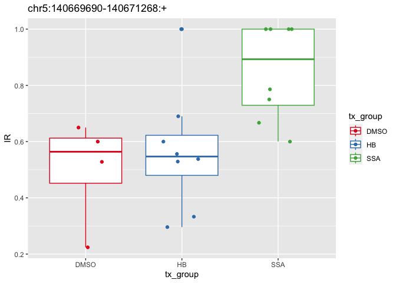

# intron retention results analysis 2025 10 07
Holly Beale
2025-10-08

``` r
library(tidyverse)
```

    Warning: package 'readr' was built under R version 4.2.3

    Warning: package 'dplyr' was built under R version 4.2.3

    ── Attaching core tidyverse packages ──────────────────────── tidyverse 2.0.0 ──
    ✔ dplyr     1.1.4     ✔ readr     2.1.5
    ✔ forcats   1.0.0     ✔ stringr   1.5.0
    ✔ ggplot2   3.4.4     ✔ tibble    3.2.1
    ✔ lubridate 1.9.4     ✔ tidyr     1.3.1
    ✔ purrr     1.0.2     
    ── Conflicts ────────────────────────────────────────── tidyverse_conflicts() ──
    ✖ dplyr::filter() masks stats::filter()
    ✖ dplyr::lag()    masks stats::lag()
    ℹ Use the conflicted package (<http://conflicted.r-lib.org/>) to force all conflicts to become errors

``` r
library(here)
```

    here() starts at /Users/hbeale/Documents/Dropbox/ucsc/projects/gitCode/splicedice_analysis

``` r
library(janitor)
```


    Attaching package: 'janitor'

    The following objects are masked from 'package:stats':

        chisq.test, fisher.test

to get data

    scp ubuntu@10.50.100.135://mnt/splicedice_ir_example_archives/2025.10.03_22.17.53/analysis/_intron_retention.tsv large_data/ir_example_2025.10.03_22.17.53/

``` r
ir_table <- read_tsv(here("large_data/ir_example_2025.10.03_22.17.53/_intron_retention.tsv"))
```

    Rows: 45457 Columns: 21
    ── Column specification ────────────────────────────────────────────────────────
    Delimiter: "\t"
    chr  (1): Junction
    dbl (20): S65_DMSO_1, S76_DMSO_4, S75_DMSO_3, S66_DMSO_2, S73_HB_10001, S83_...

    ℹ Use `spec()` to retrieve the full column specification for this data.
    ℹ Specify the column types or set `show_col_types = FALSE` to quiet this message.

``` r
javier_ir_table <- read_tsv(here("large_data/erj_data/SSA_Jurica_intron_retention.tsv"))
```

    Rows: 35694 Columns: 21
    ── Column specification ────────────────────────────────────────────────────────
    Delimiter: "\t"
    chr  (1): Junction
    dbl (20): S65_DMSO, S66_DMSO, S75_DMSO, S76_DMSO, S73_HB10001, S74_HB10002, ...

    ℹ Use `spec()` to retrieve the full column specification for this data.
    ℹ Specify the column types or set `show_col_types = FALSE` to quiet this message.

``` r
ir_table_long <- ir_table %>%
  pivot_longer(-Junction,
               names_to = "sample",
               values_to = "IR") %>%
  mutate(tx_group = str_replace(sample, "^.*_([A-Z]*)_.*$", "\\1"))

summary(ir_table_long$IR)
```

       Min. 1st Qu.  Median    Mean 3rd Qu.    Max.    NA's 
       0.00    0.00    0.00    0.05    0.01    1.00   80427 

``` r
# What junction has the most inclusions
ir_table_long %>%
  group_by(Junction) %>%
  summarize(total_junction_val = sum(IR)) %>%
  filter(total_junction_val < 18) %>%
  arrange(desc(total_junction_val)) %>%
  head()
```

    Warning: 'xfun::attr()' is deprecated.
    Use 'xfun::attr2()' instead.
    See help("Deprecated")

| Junction                   | total_junction_val |
|:---------------------------|-------------------:|
| chr17:47621970-47623796:+  |             17.953 |
| chr16:16294295-16294626:+  |             17.937 |
| chr6:31161577-31161792:+   |             17.925 |
| chr15:90265876-90266287:+  |             17.913 |
| chr1:117522937-117525088:+ |             17.911 |
| chr11:65503905-65504325:+  |             17.910 |

## What junction is the most differnet between two groups?

``` r
ir_table_long_group_features_per_jxn <- ir_table_long %>%
  filter(!tx_group == "DMSO") %>%
  group_by(Junction, tx_group) %>%
  mutate(n_group = sum(! is.na(IR)),
         sd_group = sd(IR)) 

this_jxn <- "chr5:140669690-140671268:+"


ir_table_long_group_features_per_jxn  %>%
         filter(Junction == this_jxn)
```

    Warning: 'xfun::attr()' is deprecated.
    Use 'xfun::attr2()' instead.
    See help("Deprecated")

| Junction                   | sample       |    IR | tx_group | n_group |  sd_group |
|:---------------------------|:-------------|------:|:---------|--------:|----------:|
| chr5:140669690-140671268:+ | S73_HB_10001 | 1.000 | HB       |       8 | 0.2185359 |
| chr5:140669690-140671268:+ | S83_HB_10003 | 0.600 | HB       |       8 | 0.2185359 |
| chr5:140669690-140671268:+ | S84_HB_10004 | 0.556 | HB       |       8 | 0.2185359 |
| chr5:140669690-140671268:+ | S74_HB_10002 | 0.296 | HB       |       8 | 0.2185359 |
| chr5:140669690-140671268:+ | S81_HB_1003  | 0.333 | HB       |       8 | 0.2185359 |
| chr5:140669690-140671268:+ | S72_HB_1002  | 0.690 | HB       |       8 | 0.2185359 |
| chr5:140669690-140671268:+ | S71_HB_1001  | 0.538 | HB       |       8 | 0.2185359 |
| chr5:140669690-140671268:+ | S82_HB_1004  | 0.529 | HB       |       8 | 0.2185359 |
| chr5:140669690-140671268:+ | S69_SSA_1001 | 1.000 | SSA      |       8 | 0.1690663 |
| chr5:140669690-140671268:+ | S70_SSA_1002 | 1.000 | SSA      |       8 | 0.1690663 |
| chr5:140669690-140671268:+ | S80_SSA_1004 | 0.600 | SSA      |       8 | 0.1690663 |
| chr5:140669690-140671268:+ | S79_SSA_1003 | 1.000 | SSA      |       8 | 0.1690663 |
| chr5:140669690-140671268:+ | S68_SSA_102  | 0.750 | SSA      |       8 | 0.1690663 |
| chr5:140669690-140671268:+ | S67_SSA_101  | 0.667 | SSA      |       8 | 0.1690663 |
| chr5:140669690-140671268:+ | S77_SSA_103  | 1.000 | SSA      |       8 | 0.1690663 |
| chr5:140669690-140671268:+ | S78_SSA_104  | 0.786 | SSA      |       8 | 0.1690663 |

``` r
ir_table_long_for_t_test <- ir_table_long_group_features_per_jxn %>%
  group_by(Junction) %>%
  filter(all(n_group > 5),
         all(sd_group > 0.1)) %>%
  na.omit()

ttest_results <- ir_table_long_for_t_test %>%
  group_by(Junction) %>%
  summarize(p_val = 
              (t.test(
                IR[tx_group == "HB"],
                IR[tx_group == "SSA"]))$p.value)

ttest_results %>%
  arrange(p_val) %>%
  head()
```

    Warning: 'xfun::attr()' is deprecated.
    Use 'xfun::attr2()' instead.
    See help("Deprecated")

| Junction                   |     p_val |
|:---------------------------|----------:|
| chr5:140669690-140671268:+ | 0.0124311 |
| chr2:135168749-135169733:+ | 0.0191899 |
| chr20:62836333-62836477:+  | 0.0305990 |
| chrX:102602102-102605481:+ | 0.0508748 |
| chr12:6724330-6724613:+    | 0.0537265 |
| chr1:85581578-85581927:+   | 0.0587396 |

why is this considered a junction? it looks like the 5’ UTR of two genes
maybe one is more highly expressed in different conditions

``` r
this_jxn <- "chr5:140669690-140671268:+"

ggplot(
  ir_table_long %>%
         filter(Junction == this_jxn),
  aes(x = tx_group,
               y = IR,
      color = tx_group)) +
  geom_boxplot() +
  geom_jitter(width = 0.2, height = 0) +
  scale_color_brewer(palette = "Set1") +
  ggtitle(this_jxn)
```



``` r
this_jxn <- "chr17:41793801-41793997:+" #"GL000195.1:142240-167732:+"

ir_table_long_for_t_test %>%
  filter(Junction == this_jxn)
```

    Warning: 'xfun::attr()' is deprecated.
    Use 'xfun::attr2()' instead.
    See help("Deprecated")

| Junction | sample |  IR | tx_group | n_group | sd_group |
|:---------|:-------|----:|:---------|--------:|---------:|

``` r
ir_table_long_group_features_per_jxn %>%
  arrange(sd_group) %>%
  head
```

    Warning: 'xfun::attr()' is deprecated.
    Use 'xfun::attr2()' instead.
    See help("Deprecated")

| Junction                   | sample       |  IR | tx_group | n_group | sd_group |
|:---------------------------|:-------------|----:|:---------|--------:|---------:|
| GL000195.1:138140-142142:+ | S73_HB_10001 |   0 | HB       |       8 |        0 |
| GL000195.1:138140-142142:+ | S83_HB_10003 |   0 | HB       |       8 |        0 |
| GL000195.1:138140-142142:+ | S84_HB_10004 |   0 | HB       |       8 |        0 |
| GL000195.1:138140-142142:+ | S74_HB_10002 |   0 | HB       |       8 |        0 |
| GL000195.1:138140-142142:+ | S81_HB_1003  |   0 | HB       |       8 |        0 |
| GL000195.1:138140-142142:+ | S72_HB_1002  |   0 | HB       |       8 |        0 |

``` r
summary(ir_table_long_group_features_per_jxn$sd_group)
```

       Min. 1st Qu.  Median    Mean 3rd Qu.    Max.    NA's 
       0.00    0.00    0.01    0.02    0.02    0.53  273872 

``` r
#                       
# ir_table_long_group_features_per_jxn %>%
#   group_by(Junction) %>%
#   mutate(n_HB_group = sum(tx_group == "HB"),
#             n_SSA_group = sum(tx_group == "SSA")) %>%
#   filter(n_HB_group > 3, 
#          n_SSA_group > 3) %>%
#   sum
# 
# (
#             n_SSA_group = sum(tx_group == "SSA")) %>%
#   filter(n_HB_group > 3, 
#          n_SSA_group > 3) %>%
#   summarize(p_val = (t.test(IR[tx_group == "HB"],
# 
#                             
# ir_table_long %>%
#   na.omit() %>%
#   group_by(Junction) %>%
#   mutate(n_HB_group = sum(tx_group == "HB"),
#             n_SSA_group = sum(tx_group == "SSA")) %>%
#   filter(n_HB_group > 3, 
#          n_SSA_group > 3) %>%
#   summarize(p_val = (t.test(IR[tx_group == "HB"],
#                                IR[tx_group == "SSA"]))$p.value)
# 
# 
# ir_table_long %>%
#   filter(Junction == "chr11:12259897-12260635:+")
# t.test(1:50, 50:100)
```

# compare to erj results

``` r
javier_ir_table_long <- javier_ir_table %>%
  pivot_longer(-Junction,
               names_to = "sample",
               values_to = "IR") %>%
  mutate(tx_group = str_replace(sample, "^.*_([A-Z]*)_.*$", "\\1"),
         S_number = str_remove(sample, "_.*$"))

ir_table_long_for_comparison <- ir_table_long %>%
  mutate(S_number = str_remove(sample, "_.*$"))

table(ir_table_long_for_comparison$S_number)
```


      S65   S66   S67   S68   S69   S70   S71   S72   S73   S74   S75   S76   S77 
    45457 45457 45457 45457 45457 45457 45457 45457 45457 45457 45457 45457 45457 
      S78   S79   S80   S81   S82   S83   S84 
    45457 45457 45457 45457 45457 45457 45457 

``` r
table(javier_ir_table_long$S_number)
```


      S65   S66   S67   S68   S69   S70   S71   S72   S73   S74   S75   S76   S77 
    35694 35694 35694 35694 35694 35694 35694 35694 35694 35694 35694 35694 35694 
      S78   S79   S80   S81   S82   S83   S84 
    35694 35694 35694 35694 35694 35694 35694 

``` r
# my results have 45457 results; javier's have 35694 results

head(ir_table_long)
```

    Warning: 'xfun::attr()' is deprecated.
    Use 'xfun::attr2()' instead.
    See help("Deprecated")

| Junction                   | sample       |  IR | tx_group |
|:---------------------------|:-------------|----:|:---------|
| GL000008.2:155531-156720:+ | S65_DMSO_1   | NaN | DMSO     |
| GL000008.2:155531-156720:+ | S76_DMSO_4   | NaN | DMSO     |
| GL000008.2:155531-156720:+ | S75_DMSO_3   | NaN | DMSO     |
| GL000008.2:155531-156720:+ | S66_DMSO_2   | NaN | DMSO     |
| GL000008.2:155531-156720:+ | S73_HB_10001 | NaN | HB       |
| GL000008.2:155531-156720:+ | S83_HB_10003 | NaN | HB       |

``` r
head(javier_ir_table_long)
```

    Warning: 'xfun::attr()' is deprecated.
    Use 'xfun::attr2()' instead.
    See help("Deprecated")

| Junction               | sample      |  IR | tx_group    | S_number |
|:-----------------------|:------------|----:|:------------|:---------|
| KI270721.1:7404-7976:+ | S65_DMSO    |   0 | S65_DMSO    | S65      |
| KI270721.1:7404-7976:+ | S66_DMSO    |   0 | S66_DMSO    | S66      |
| KI270721.1:7404-7976:+ | S75_DMSO    |   0 | S75_DMSO    | S75      |
| KI270721.1:7404-7976:+ | S76_DMSO    |   0 | S76_DMSO    | S76      |
| KI270721.1:7404-7976:+ | S73_HB10001 |   0 | S73_HB10001 | S73      |
| KI270721.1:7404-7976:+ | S74_HB10002 |   0 | S74_HB10002 | S74      |

# combine

``` r
head(ir_table_long_for_comparison)
```

    Warning: 'xfun::attr()' is deprecated.
    Use 'xfun::attr2()' instead.
    See help("Deprecated")

| Junction                   | sample       |  IR | tx_group | S_number |
|:---------------------------|:-------------|----:|:---------|:---------|
| GL000008.2:155531-156720:+ | S65_DMSO_1   | NaN | DMSO     | S65      |
| GL000008.2:155531-156720:+ | S76_DMSO_4   | NaN | DMSO     | S76      |
| GL000008.2:155531-156720:+ | S75_DMSO_3   | NaN | DMSO     | S75      |
| GL000008.2:155531-156720:+ | S66_DMSO_2   | NaN | DMSO     | S66      |
| GL000008.2:155531-156720:+ | S73_HB_10001 | NaN | HB       | S73      |
| GL000008.2:155531-156720:+ | S83_HB_10003 | NaN | HB       | S83      |

``` r
head(javier_ir_table_long)
```

    Warning: 'xfun::attr()' is deprecated.
    Use 'xfun::attr2()' instead.
    See help("Deprecated")

| Junction               | sample      |  IR | tx_group    | S_number |
|:-----------------------|:------------|----:|:------------|:---------|
| KI270721.1:7404-7976:+ | S65_DMSO    |   0 | S65_DMSO    | S65      |
| KI270721.1:7404-7976:+ | S66_DMSO    |   0 | S66_DMSO    | S66      |
| KI270721.1:7404-7976:+ | S75_DMSO    |   0 | S75_DMSO    | S75      |
| KI270721.1:7404-7976:+ | S76_DMSO    |   0 | S76_DMSO    | S76      |
| KI270721.1:7404-7976:+ | S73_HB10001 |   0 | S73_HB10001 | S73      |
| KI270721.1:7404-7976:+ | S74_HB10002 |   0 | S74_HB10002 | S74      |

``` r
both_IRs <- javier_ir_table_long %>%
  select(S_number, Junction, erj_IR=IR) %>%
  full_join(ir_table_long_for_comparison %>% rename(hcb_IR = IR),
            by=c("Junction", "S_number")) %>%
  mutate(chr = str_remove(Junction, ":.*$"),
         identical_IR = hcb_IR == erj_IR)

tabyl(both_IRs,
      identical_IR) %>%
  adorn_pct_formatting() %>%
  mutate(n=scales::number(n, big.mark = ","))
```

    Warning: 'xfun::attr()' is deprecated.
    Use 'xfun::attr2()' instead.
    See help("Deprecated")

| identical_IR | n       | percent | valid_percent |
|:-------------|:--------|:--------|:--------------|
| FALSE        | 23,393  | 2.6%    | 3.6%          |
| TRUE         | 625,996 | 68.9%   | 96.4%         |
| NA           | 259,771 | 28.6%   | \-            |

# a bunch of tooting around

``` r
tabyl(both_IRs, chr)
```

    Warning: 'xfun::attr()' is deprecated.
    Use 'xfun::attr2()' instead.
    See help("Deprecated")

| chr        |     n |   percent |
|:-----------|------:|----------:|
| GL000008.2 |    20 | 0.0000220 |
| GL000195.1 |   500 | 0.0005500 |
| GL000214.1 |   180 | 0.0001980 |
| KI270706.1 |   280 | 0.0003080 |
| KI270721.1 |    40 | 0.0000440 |
| KI270733.1 |    20 | 0.0000220 |
| KI270734.1 |    20 | 0.0000220 |
| KI270742.1 |    20 | 0.0000220 |
| KI270744.1 |    40 | 0.0000440 |
| KI270751.1 |   180 | 0.0001980 |
| chr1       | 92460 | 0.1016983 |
| chr10      | 36060 | 0.0396630 |
| chr11      | 57200 | 0.0629152 |
| chr12      | 53660 | 0.0590215 |
| chr13      | 14760 | 0.0162348 |
| chr14      | 31080 | 0.0341854 |
| chr15      | 31780 | 0.0349553 |
| chr16      | 50380 | 0.0554138 |
| chr17      | 60060 | 0.0660610 |
| chr18      | 12640 | 0.0139029 |
| chr19      | 53720 | 0.0590875 |
| chr2       | 62360 | 0.0685908 |
| chr20      | 25700 | 0.0282679 |
| chr21      |  9040 | 0.0099432 |
| chr22      | 16860 | 0.0185446 |
| chr3       | 52640 | 0.0578996 |
| chr4       | 23940 | 0.0263320 |
| chr5       | 47980 | 0.0527740 |
| chr6       | 39100 | 0.0430067 |
| chr7       | 42980 | 0.0472744 |
| chr8       | 28120 | 0.0309296 |
| chr9       | 33780 | 0.0371552 |
| chrX       | 30440 | 0.0334815 |
| chrY       |  1120 | 0.0012319 |

``` r
both_IRs_anno <- both_IRs %>%
  filter(! (is.na(erj_IR) & is.na(hcb_IR)))   %>%
  #filter(chr== "GL000008.2") %>%
  group_by(chr) %>%
  mutate(only_in_HB = is.na(erj_IR),
            only_in_ERJ = is.na(hcb_IR),
            in_both = (! is.na(erj_IR)) &  (! is.na(hcb_IR)))
         
   #      n()-only_in_HB-only_in_ERJ)
  
 table_of_chr_usage <- both_IRs_anno %>%
   summarize(only_in_HB = sum(only_in_HB, na.rm = TRUE),
            only_in_ERJ = sum(only_in_ERJ, na.rm = TRUE),
            in_both = (sum(in_both, na.rm = TRUE)))

both_IRs %>%
  filter(chr== "GL000008.2")
```

    Warning: 'xfun::attr()' is deprecated.
    Use 'xfun::attr2()' instead.
    See help("Deprecated")

| S_number | Junction | erj_IR | sample | hcb_IR | tx_group | chr | identical_IR |
|:---|:---|---:|:---|---:|:---|:---|:---|
| S65 | GL000008.2:155531-156720:+ | NA | S65_DMSO_1 | NaN | DMSO | GL000008.2 | NA |
| S76 | GL000008.2:155531-156720:+ | NA | S76_DMSO_4 | NaN | DMSO | GL000008.2 | NA |
| S75 | GL000008.2:155531-156720:+ | NA | S75_DMSO_3 | NaN | DMSO | GL000008.2 | NA |
| S66 | GL000008.2:155531-156720:+ | NA | S66_DMSO_2 | NaN | DMSO | GL000008.2 | NA |
| S73 | GL000008.2:155531-156720:+ | NA | S73_HB_10001 | NaN | HB | GL000008.2 | NA |
| S83 | GL000008.2:155531-156720:+ | NA | S83_HB_10003 | NaN | HB | GL000008.2 | NA |
| S84 | GL000008.2:155531-156720:+ | NA | S84_HB_10004 | NaN | HB | GL000008.2 | NA |
| S74 | GL000008.2:155531-156720:+ | NA | S74_HB_10002 | NaN | HB | GL000008.2 | NA |
| S81 | GL000008.2:155531-156720:+ | NA | S81_HB_1003 | NaN | HB | GL000008.2 | NA |
| S72 | GL000008.2:155531-156720:+ | NA | S72_HB_1002 | NaN | HB | GL000008.2 | NA |
| S71 | GL000008.2:155531-156720:+ | NA | S71_HB_1001 | 1 | HB | GL000008.2 | NA |
| S82 | GL000008.2:155531-156720:+ | NA | S82_HB_1004 | NaN | HB | GL000008.2 | NA |
| S69 | GL000008.2:155531-156720:+ | NA | S69_SSA_1001 | NaN | SSA | GL000008.2 | NA |
| S70 | GL000008.2:155531-156720:+ | NA | S70_SSA_1002 | NaN | SSA | GL000008.2 | NA |
| S80 | GL000008.2:155531-156720:+ | NA | S80_SSA_1004 | 0 | SSA | GL000008.2 | NA |
| S79 | GL000008.2:155531-156720:+ | NA | S79_SSA_1003 | NaN | SSA | GL000008.2 | NA |
| S68 | GL000008.2:155531-156720:+ | NA | S68_SSA_102 | 1 | SSA | GL000008.2 | NA |
| S67 | GL000008.2:155531-156720:+ | NA | S67_SSA_101 | 1 | SSA | GL000008.2 | NA |
| S77 | GL000008.2:155531-156720:+ | NA | S77_SSA_103 | NaN | SSA | GL000008.2 | NA |
| S78 | GL000008.2:155531-156720:+ | NA | S78_SSA_104 | NaN | SSA | GL000008.2 | NA |

``` r
both_IRs_anno %>%
  filter(str_detect(chr, "chr"),
         only_in_HB) %>%
  head
```

    Warning: 'xfun::attr()' is deprecated.
    Use 'xfun::attr2()' instead.
    See help("Deprecated")

| S_number | Junction | erj_IR | sample | hcb_IR | tx_group | chr | identical_IR | only_in_HB | only_in_ERJ | in_both |
|:---|:---|---:|:---|---:|:---|:---|:---|:---|:---|:---|
| S65 | chr10:100233443-100233952:+ | NaN | S65_DMSO_1 | 0 | DMSO | chr10 | NA | TRUE | FALSE | FALSE |
| S75 | chr10:100233443-100233952:+ | NaN | S75_DMSO_3 | 0 | DMSO | chr10 | NA | TRUE | FALSE | FALSE |
| S76 | chr10:100233443-100233952:+ | NaN | S76_DMSO_4 | 0 | DMSO | chr10 | NA | TRUE | FALSE | FALSE |
| S74 | chr10:100233443-100233952:+ | NaN | S74_HB_10002 | 0 | HB | chr10 | NA | TRUE | FALSE | FALSE |
| S84 | chr10:100233443-100233952:+ | NaN | S84_HB_10004 | 0 | HB | chr10 | NA | TRUE | FALSE | FALSE |
| S71 | chr10:100233443-100233952:+ | NaN | S71_HB_1001 | 0 | HB | chr10 | NA | TRUE | FALSE | FALSE |

``` r
both_IRs_anno %>%
  filter(str_detect(chr, "chr"),
         only_in_HB,
         hcb_IR > 0) %>%
  head
```

    Warning: 'xfun::attr()' is deprecated.
    Use 'xfun::attr2()' instead.
    See help("Deprecated")

| S_number | Junction | erj_IR | sample | hcb_IR | tx_group | chr | identical_IR | only_in_HB | only_in_ERJ | in_both |
|:---|:---|---:|:---|---:|:---|:---|:---|:---|:---|:---|
| S65 | chr10:100374012-100375211:+ | NA | S65_DMSO_1 | 0.030 | DMSO | chr10 | NA | TRUE | FALSE | FALSE |
| S75 | chr10:100374012-100375211:+ | NA | S75_DMSO_3 | 0.038 | DMSO | chr10 | NA | TRUE | FALSE | FALSE |
| S84 | chr10:100374012-100375211:+ | NA | S84_HB_10004 | 0.018 | HB | chr10 | NA | TRUE | FALSE | FALSE |
| S81 | chr10:100374012-100375211:+ | NA | S81_HB_1003 | 0.014 | HB | chr10 | NA | TRUE | FALSE | FALSE |
| S72 | chr10:100374012-100375211:+ | NA | S72_HB_1002 | 0.023 | HB | chr10 | NA | TRUE | FALSE | FALSE |
| S71 | chr10:100374012-100375211:+ | NA | S71_HB_1001 | 0.014 | HB | chr10 | NA | TRUE | FALSE | FALSE |

``` r
both_IRs_anno %>%
  filter(str_detect(chr, "chr"),
         ! (hcb_IR > 0 & is.na(erj_IR))) %>%
  head
```

    Warning: 'xfun::attr()' is deprecated.
    Use 'xfun::attr2()' instead.
    See help("Deprecated")

| S_number | Junction | erj_IR | sample | hcb_IR | tx_group | chr | identical_IR | only_in_HB | only_in_ERJ | in_both |
|:---|:---|---:|:---|---:|:---|:---|:---|:---|:---|:---|
| S65 | chr10:1000868-1000947:+ | 0.010 | S65_DMSO_1 | 0.010 | DMSO | chr10 | TRUE | FALSE | FALSE | TRUE |
| S66 | chr10:1000868-1000947:+ | 0.008 | S66_DMSO_2 | 0.008 | DMSO | chr10 | TRUE | FALSE | FALSE | TRUE |
| S75 | chr10:1000868-1000947:+ | 0.002 | S75_DMSO_3 | 0.002 | DMSO | chr10 | TRUE | FALSE | FALSE | TRUE |
| S76 | chr10:1000868-1000947:+ | 0.011 | S76_DMSO_4 | 0.011 | DMSO | chr10 | TRUE | FALSE | FALSE | TRUE |
| S73 | chr10:1000868-1000947:+ | 0.006 | S73_HB_10001 | 0.006 | HB | chr10 | TRUE | FALSE | FALSE | TRUE |
| S74 | chr10:1000868-1000947:+ | 0.000 | S74_HB_10002 | 0.000 | HB | chr10 | TRUE | FALSE | FALSE | TRUE |

``` r
both_IRs_have_values_in_chr_discrepant <- both_IRs_anno %>%
  filter(str_detect(chr, "chr"),
         erj_IR != hcb_IR,
         ! (hcb_IR > 0 & is.na(erj_IR)))


both_IRs_anno %>%
  filter(str_detect(chr, "chr"),
         erj_IR == hcb_IR,
         ! (hcb_IR > 0 & is.na(erj_IR))) %>%
  head
```

    Warning: 'xfun::attr()' is deprecated.
    Use 'xfun::attr2()' instead.
    See help("Deprecated")

| S_number | Junction | erj_IR | sample | hcb_IR | tx_group | chr | identical_IR | only_in_HB | only_in_ERJ | in_both |
|:---|:---|---:|:---|---:|:---|:---|:---|:---|:---|:---|
| S65 | chr10:1000868-1000947:+ | 0.010 | S65_DMSO_1 | 0.010 | DMSO | chr10 | TRUE | FALSE | FALSE | TRUE |
| S66 | chr10:1000868-1000947:+ | 0.008 | S66_DMSO_2 | 0.008 | DMSO | chr10 | TRUE | FALSE | FALSE | TRUE |
| S75 | chr10:1000868-1000947:+ | 0.002 | S75_DMSO_3 | 0.002 | DMSO | chr10 | TRUE | FALSE | FALSE | TRUE |
| S76 | chr10:1000868-1000947:+ | 0.011 | S76_DMSO_4 | 0.011 | DMSO | chr10 | TRUE | FALSE | FALSE | TRUE |
| S73 | chr10:1000868-1000947:+ | 0.006 | S73_HB_10001 | 0.006 | HB | chr10 | TRUE | FALSE | FALSE | TRUE |
| S74 | chr10:1000868-1000947:+ | 0.000 | S74_HB_10002 | 0.000 | HB | chr10 | TRUE | FALSE | FALSE | TRUE |

``` r
both_IRs_anno %>%
  filter(str_detect(chr, "chr"),
         erj_IR == hcb_IR,
         ! (hcb_IR > 0 & is.na(erj_IR))) %>%
  head
```

    Warning: 'xfun::attr()' is deprecated.
    Use 'xfun::attr2()' instead.
    See help("Deprecated")

| S_number | Junction | erj_IR | sample | hcb_IR | tx_group | chr | identical_IR | only_in_HB | only_in_ERJ | in_both |
|:---|:---|---:|:---|---:|:---|:---|:---|:---|:---|:---|
| S65 | chr10:1000868-1000947:+ | 0.010 | S65_DMSO_1 | 0.010 | DMSO | chr10 | TRUE | FALSE | FALSE | TRUE |
| S66 | chr10:1000868-1000947:+ | 0.008 | S66_DMSO_2 | 0.008 | DMSO | chr10 | TRUE | FALSE | FALSE | TRUE |
| S75 | chr10:1000868-1000947:+ | 0.002 | S75_DMSO_3 | 0.002 | DMSO | chr10 | TRUE | FALSE | FALSE | TRUE |
| S76 | chr10:1000868-1000947:+ | 0.011 | S76_DMSO_4 | 0.011 | DMSO | chr10 | TRUE | FALSE | FALSE | TRUE |
| S73 | chr10:1000868-1000947:+ | 0.006 | S73_HB_10001 | 0.006 | HB | chr10 | TRUE | FALSE | FALSE | TRUE |
| S74 | chr10:1000868-1000947:+ | 0.000 | S74_HB_10002 | 0.000 | HB | chr10 | TRUE | FALSE | FALSE | TRUE |

``` r
ggplot(both_IRs_have_values_in_chr_discrepant) +
  geom_hex(aes(x=erj_IR, y=hcb_IR))
```


