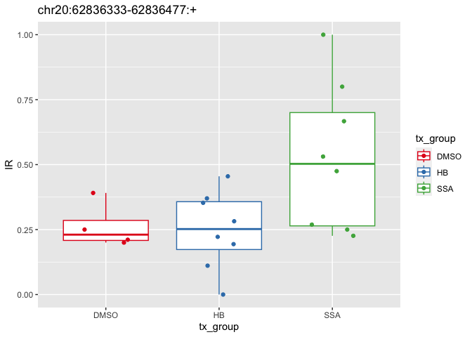

# intron retention results analysis 2025 10 08
Holly Beale
2025-10-08

``` r
library(tidyverse)
```

    Warning: package 'readr' was built under R version 4.2.3
    
    Warning: package 'dplyr' was built under R version 4.2.3
    
    ── Attaching core tidyverse packages ──────────────────────── tidyverse 2.0.0 ──
    ✔ dplyr     1.1.4     ✔ readr     2.1.5
    ✔ forcats   1.0.0     ✔ stringr   1.5.0
    ✔ ggplot2   3.4.4     ✔ tibble    3.2.1
    ✔ lubridate 1.9.4     ✔ tidyr     1.3.1
    ✔ purrr     1.0.2     
    ── Conflicts ────────────────────────────────────────── tidyverse_conflicts() ──
    ✖ dplyr::filter() masks stats::filter()
    ✖ dplyr::lag()    masks stats::lag()
    ℹ Use the conflicted package (<http://conflicted.r-lib.org/>) to force all conflicts to become errors

``` r
library(here)
```

    here() starts at /Users/hbeale/Documents/Dropbox/ucsc/projects/gitCode/splicedice_analysis

``` r
library(janitor)
```


    Attaching package: 'janitor'
    
    The following objects are masked from 'package:stats':
    
        chisq.test, fisher.test

``` r
library(khroma) # for scale_fill_vibrant
```

``` r
ir_table <- read_tsv(here("large_data/ir_example_2025.10.08_21.47.01/_intron_retention.tsv"))
```

    Rows: 35694 Columns: 21
    ── Column specification ────────────────────────────────────────────────────────
    Delimiter: "\t"
    chr  (1): Junction
    dbl (20): S73_HB_10001, S76_DMSO_4, S65_DMSO_1, S75_DMSO_3, S74_HB_10002, S6...
    
    ℹ Use `spec()` to retrieve the full column specification for this data.
    ℹ Specify the column types or set `show_col_types = FALSE` to quiet this message.

``` r
javier_ir_table <- read_tsv(here("large_data/erj_data/SSA_Jurica_intron_retention.tsv"))
```

    Rows: 35694 Columns: 21
    ── Column specification ────────────────────────────────────────────────────────
    Delimiter: "\t"
    chr  (1): Junction
    dbl (20): S65_DMSO, S66_DMSO, S75_DMSO, S76_DMSO, S73_HB10001, S74_HB10002, ...
    
    ℹ Use `spec()` to retrieve the full column specification for this data.
    ℹ Specify the column types or set `show_col_types = FALSE` to quiet this message.

``` r
dim(ir_table)
```

    [1] 35694    21

``` r
dim(javier_ir_table)
```

    [1] 35694    21

## Were the same junctions found in both?

``` r
identical(ir_table$Junction, javier_ir_table$Junction)
```

    [1] TRUE

# Combine data

``` r
ir_table_long <- ir_table %>%
  pivot_longer(-Junction,
               names_to = "sample",
               values_to = "IR") %>%
  mutate(tx_group = str_replace(sample, "^.*_([A-Z]*)_.*$", "\\1"),
         S_number = str_remove(sample, "_.*$"))


javier_ir_table_long <- javier_ir_table %>%
  pivot_longer(-Junction,
               names_to = "sample",
               values_to = "IR") %>%
  mutate(S_number = str_remove(sample, "_.*$"))


both_IRs <- javier_ir_table_long %>%
  select(S_number, Junction, erj_IR=IR) %>%
  full_join(ir_table_long %>% rename(hcb_IR = IR),
            by=c("Junction", "S_number")) %>%
  mutate(chr = str_remove(Junction, ":.*$"),
         identical_IR = hcb_IR == erj_IR)
```

# did I parse samples names right?

``` r
identical(
table(ir_table_long$S_number),
table(javier_ir_table_long$S_number))
```

    [1] TRUE

# explore values

``` r
both_IRs_anno <- both_IRs %>%
  mutate(match_type = case_when(
    is.na(erj_IR) & is.na(hcb_IR) ~ "both NA",
    is.na(erj_IR) & hcb_IR == 0 ~ "erj_NA, hb 0",
    is.na(hcb_IR) & erj_IR == 0 ~ "erj_0, hb NA",
    is.na(erj_IR) | is.na(hcb_IR) ~ "1 is NA, other is not 0",
    erj_IR==0 & hcb_IR==0 ~ "both are zero",
    erj_IR==hcb_IR ~ "identical non-zero values",
    erj_IR!=hcb_IR ~ "different values",
    TRUE ~ "other"))

tabyl(both_IRs_anno, match_type) %>%
  arrange(desc(n)) %>%
  adorn_pct_formatting() %>%
  mutate(n=scales::number(n, big.mark = ","))
```

    Warning: 'xfun::attr()' is deprecated.
    Use 'xfun::attr2()' instead.
    See help("Deprecated")

| match_type                | n       | percent |
|:--------------------------|:--------|:--------|
| both are zero             | 414,918 | 58.1%   |
| identical non-zero values | 210,435 | 29.5%   |
| both NA                   | 62,711  | 8.8%    |
| different values          | 23,993  | 3.4%    |
| erj_NA, hb 0              | 1,709   | 0.2%    |
| erj_0, hb NA              | 114     | 0.0%    |

``` r
both_IRs_anno %>%
  filter(match_type == "different values") %>%
  head
```

    Warning: 'xfun::attr()' is deprecated.
    Use 'xfun::attr2()' instead.
    See help("Deprecated")

| S_number | Junction | erj_IR | sample | hcb_IR | tx_group | chr | identical_IR | match_type |
|:---|:---|---:|:---|---:|:---|:---|:---|:---|
| S74 | chr10:1001013-1005817:+ | 0.011 | S74_HB_10002 | 0.012 | HB | chr10 | FALSE | different values |
| S66 | chr10:100233443-100233952:+ | 1.000 | S66_DMSO_2 | 0.024 | DMSO | chr10 | FALSE | different values |
| S73 | chr10:100233443-100233952:+ | 1.000 | S73_HB_10001 | 0.014 | HB | chr10 | FALSE | different values |
| S83 | chr10:100233443-100233952:+ | 1.000 | S83_HB_10003 | 0.017 | HB | chr10 | FALSE | different values |
| S72 | chr10:100233443-100233952:+ | 1.000 | S72_HB_1002 | 0.007 | HB | chr10 | FALSE | different values |
| S67 | chr10:100233443-100233952:+ | 1.000 | S67_SSA_101 | 0.009 | SSA | chr10 | FALSE | different values |

# Non matching values aren’t chromosome specific

``` r
both_IRs_anno %>%
  filter(match_type %in%
           c("different values", "identical non-zero values")) %>%
  ggplot() +
  geom_bar(aes(x=chr, fill = match_type)) +
  scale_fill_vibrant(scale_name="")   +
  theme(axis.text.x = element_text(angle = 90, hjust = 1, vjust = 0.5))
```


``` r
both_IRs_anno %>%
  filter(match_type %in%
           c("different values", "identical non-zero values")) %>%
  tabyl(chr, match_type) %>%
  adorn_percentages() %>%
  adorn_pct_formatting()
```

    Warning: 'xfun::attr()' is deprecated.
    Use 'xfun::attr2()' instead.
    See help("Deprecated")

| chr        | different values | identical non-zero values |
|:-----------|:-----------------|:--------------------------|
| chr1       | 11.1%            | 88.9%                     |
| chr10      | 10.3%            | 89.7%                     |
| chr11      | 9.2%             | 90.8%                     |
| chr12      | 10.5%            | 89.5%                     |
| chr13      | 13.6%            | 86.4%                     |
| chr14      | 10.9%            | 89.1%                     |
| chr15      | 9.1%             | 90.9%                     |
| chr16      | 7.7%             | 92.3%                     |
| chr17      | 10.8%            | 89.2%                     |
| chr18      | 14.8%            | 85.2%                     |
| chr19      | 6.7%             | 93.3%                     |
| chr2       | 10.8%            | 89.2%                     |
| chr20      | 12.7%            | 87.3%                     |
| chr21      | 12.8%            | 87.2%                     |
| chr22      | 9.3%             | 90.7%                     |
| chr3       | 10.5%            | 89.5%                     |
| chr4       | 7.1%             | 92.9%                     |
| chr5       | 12.3%            | 87.7%                     |
| chr6       | 8.5%             | 91.5%                     |
| chr7       | 11.5%            | 88.5%                     |
| chr8       | 7.0%             | 93.0%                     |
| chr9       | 13.0%            | 87.0%                     |
| chrX       | 9.2%             | 90.8%                     |
| chrY       | 13.9%            | 86.1%                     |
| KI270721.1 | 0.0%             | 100.0%                    |
| KI270734.1 | 0.0%             | 100.0%                    |

``` r
both_IRs_anno %>%
  filter(match_type == "different values") %>%
  tabyl(S_number)
```

    Warning: 'xfun::attr()' is deprecated.
    Use 'xfun::attr2()' instead.
    See help("Deprecated")

| S_number |    n |   percent |
|:---------|-----:|----------:|
| S65      |  652 | 0.0271746 |
| S66      | 1266 | 0.0527654 |
| S67      | 1903 | 0.0793148 |
| S68      | 1496 | 0.0623515 |
| S69      |  584 | 0.0243404 |
| S70      | 1231 | 0.0513066 |
| S71      | 1406 | 0.0586004 |
| S72      | 1041 | 0.0433877 |
| S73      | 1057 | 0.0440545 |
| S74      | 1794 | 0.0747718 |
| S75      | 1157 | 0.0482224 |
| S76      | 1036 | 0.0431793 |
| S77      | 1367 | 0.0569750 |
| S78      | 1614 | 0.0672696 |
| S79      |   41 | 0.0017088 |
| S80      | 1079 | 0.0449715 |
| S81      | 1075 | 0.0448047 |
| S82      | 1206 | 0.0502647 |
| S83      | 1581 | 0.0658942 |
| S84      | 1407 | 0.0586421 |

# Non matching values are usually, not always similar

``` r
ggplot(both_IRs_anno %>%
  filter(match_type == "different values")) +
  geom_hex(aes(x=erj_IR, y=hcb_IR))
```


# Analysis of results

``` r
summary(ir_table_long$IR)
```

       Min. 1st Qu.  Median    Mean 3rd Qu.    Max.    NA's 
       0.00    0.00    0.00    0.04    0.01    1.00   62825 

``` r
# What junction has the most inclusions
ir_table_long %>%
  group_by(Junction) %>%
  summarize(total_junction_val = sum(IR)) %>%
  filter(total_junction_val < 18) %>%
  arrange(desc(total_junction_val)) %>%
  head()
```

    Warning: 'xfun::attr()' is deprecated.
    Use 'xfun::attr2()' instead.
    See help("Deprecated")

| Junction                  | total_junction_val |
|:--------------------------|-------------------:|
| chr17:47621970-47623796:+ |             17.953 |
| chr11:65503905-65504325:+ |             17.938 |
| chr16:16294295-16294626:+ |             17.937 |
| chr15:90265876-90266287:+ |             17.913 |
| chr16:16294348-16294626:+ |             17.859 |
| chr12:56042064-56042132:+ |             17.788 |

## What junction is the most different between two groups?

``` r
ir_table_long_group_features_per_jxn <- ir_table_long %>%
  filter(!tx_group == "DMSO") %>%
  group_by(Junction, tx_group) %>%
  mutate(n_group = sum(! is.na(IR)),
         sd_group = sd(IR)) 

ir_table_long_for_t_test <- ir_table_long_group_features_per_jxn %>%
  group_by(Junction) %>%
  filter(all(n_group > 5),
         all(sd_group > 0.1)) %>%
  na.omit()

ttest_results <- ir_table_long_for_t_test %>%
  group_by(Junction) %>%
  summarize(p_val = 
              (t.test(
                IR[tx_group == "HB"],
                IR[tx_group == "SSA"]))$p.value)

ttest_results %>%
  arrange(p_val) %>%
  head()
```

    Warning: 'xfun::attr()' is deprecated.
    Use 'xfun::attr2()' instead.
    See help("Deprecated")

| Junction                   |     p_val |
|:---------------------------|----------:|
| chr20:62836333-62836477:+  | 0.0313154 |
| chrX:102602102-102605481:+ | 0.0508748 |
| chr12:6724330-6724613:+    | 0.0551218 |
| chr1:85581578-85581927:+   | 0.0586110 |
| chr1:37482540-37482736:+   | 0.0588008 |
| chr6:31158722-31159126:+   | 0.0675912 |

why is this considered a junction? it looks like the 5’ UTR of two genes
maybe one is more highly expressed in different conditions

``` r
this_jxn <- "chr20:62836333-62836477:+" #"chr5:140669690-140671268:+"


ggplot(
  ir_table_long %>%
         filter(Junction == this_jxn),
  aes(x = tx_group,
               y = IR,
      color = tx_group)) +
  geom_boxplot() +
  geom_jitter(width = 0.2, height = 0) +
  scale_color_brewer(palette = "Set1") +
  ggtitle(this_jxn)
```



``` r
this_jxn <- "chr17:41793801-41793997:+" #"GL000195.1:142240-167732:+"

ir_table_long_for_t_test %>%
  filter(Junction == this_jxn)
```

    Warning: 'xfun::attr()' is deprecated.
    Use 'xfun::attr2()' instead.
    See help("Deprecated")

| Junction | sample |  IR | tx_group | S_number | n_group | sd_group |
|:---------|:-------|----:|:---------|:---------|--------:|---------:|

``` r
ir_table_long_group_features_per_jxn %>%
  arrange(sd_group) %>%
  head
```

    Warning: 'xfun::attr()' is deprecated.
    Use 'xfun::attr2()' instead.
    See help("Deprecated")

| Junction               | sample       |  IR | tx_group | S_number | n_group | sd_group |
|:-----------------------|:-------------|----:|:---------|:---------|--------:|---------:|
| KI270721.1:7404-7976:+ | S73_HB_10001 |   0 | HB       | S73      |       8 |        0 |
| KI270721.1:7404-7976:+ | S74_HB_10002 |   0 | HB       | S74      |       8 |        0 |
| KI270721.1:7404-7976:+ | S83_HB_10003 |   0 | HB       | S83      |       8 |        0 |
| KI270721.1:7404-7976:+ | S84_HB_10004 |   0 | HB       | S84      |       8 |        0 |
| KI270721.1:7404-7976:+ | S72_HB_1002  |   0 | HB       | S72      |       8 |        0 |
| KI270721.1:7404-7976:+ | S81_HB_1003  |   0 | HB       | S81      |       8 |        0 |

``` r
summary(ir_table_long_group_features_per_jxn$sd_group)
```

       Min. 1st Qu.  Median    Mean 3rd Qu.    Max.    NA's 
       0.00    0.00    0.01    0.02    0.02    0.53  214592 

``` r
#                       
# ir_table_long_group_features_per_jxn %>%
#   group_by(Junction) %>%
#   mutate(n_HB_group = sum(tx_group == "HB"),
#             n_SSA_group = sum(tx_group == "SSA")) %>%
#   filter(n_HB_group > 3, 
#          n_SSA_group > 3) %>%
#   sum
# 
# (
#             n_SSA_group = sum(tx_group == "SSA")) %>%
#   filter(n_HB_group > 3, 
#          n_SSA_group > 3) %>%
#   summarize(p_val = (t.test(IR[tx_group == "HB"],
# 
#                             
# ir_table_long %>%
#   na.omit() %>%
#   group_by(Junction) %>%
#   mutate(n_HB_group = sum(tx_group == "HB"),
#             n_SSA_group = sum(tx_group == "SSA")) %>%
#   filter(n_HB_group > 3, 
#          n_SSA_group > 3) %>%
#   summarize(p_val = (t.test(IR[tx_group == "HB"],
#                                IR[tx_group == "SSA"]))$p.value)
# 
# 
# ir_table_long %>%
#   filter(Junction == "chr11:12259897-12260635:+")
# t.test(1:50, 50:100)
```
