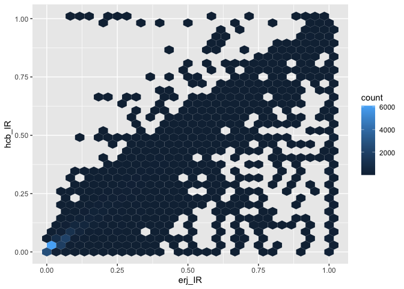
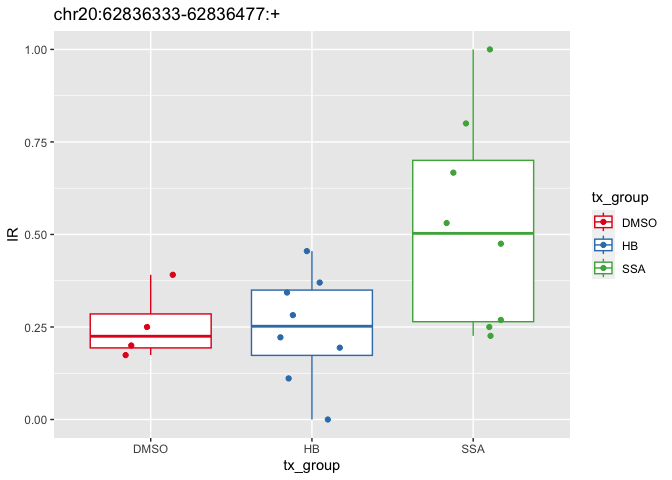

# intron retention results analysis v2 on older data
Holly Beale
2025-10-08

``` r
library(tidyverse)
```

    Warning: package 'readr' was built under R version 4.2.3

    Warning: package 'dplyr' was built under R version 4.2.3

    ── Attaching core tidyverse packages ──────────────────────── tidyverse 2.0.0 ──
    ✔ dplyr     1.1.4     ✔ readr     2.1.5
    ✔ forcats   1.0.0     ✔ stringr   1.5.0
    ✔ ggplot2   3.4.4     ✔ tibble    3.2.1
    ✔ lubridate 1.9.4     ✔ tidyr     1.3.1
    ✔ purrr     1.0.2     
    ── Conflicts ────────────────────────────────────────── tidyverse_conflicts() ──
    ✖ dplyr::filter() masks stats::filter()
    ✖ dplyr::lag()    masks stats::lag()
    ℹ Use the conflicted package (<http://conflicted.r-lib.org/>) to force all conflicts to become errors

``` r
library(here)
```

    here() starts at /Users/hbeale/Documents/Dropbox/ucsc/projects/gitCode/splicedice_analysis

``` r
library(janitor)
```


    Attaching package: 'janitor'

    The following objects are masked from 'package:stats':

        chisq.test, fisher.test

``` r
ir_table <- read_tsv(here("large_data/ir_example_2025.10.03_22.17.53/_intron_retention.tsv"))
```

    Rows: 45457 Columns: 21
    ── Column specification ────────────────────────────────────────────────────────
    Delimiter: "\t"
    chr  (1): Junction
    dbl (20): S65_DMSO_1, S76_DMSO_4, S75_DMSO_3, S66_DMSO_2, S73_HB_10001, S83_...

    ℹ Use `spec()` to retrieve the full column specification for this data.
    ℹ Specify the column types or set `show_col_types = FALSE` to quiet this message.

``` r
javier_ir_table <- read_tsv(here("large_data/erj_data/SSA_Jurica_intron_retention.tsv"))
```

    Rows: 35694 Columns: 21
    ── Column specification ────────────────────────────────────────────────────────
    Delimiter: "\t"
    chr  (1): Junction
    dbl (20): S65_DMSO, S66_DMSO, S75_DMSO, S76_DMSO, S73_HB10001, S74_HB10002, ...

    ℹ Use `spec()` to retrieve the full column specification for this data.
    ℹ Specify the column types or set `show_col_types = FALSE` to quiet this message.

``` r
ir_table_long <- ir_table %>%
  pivot_longer(-Junction,
               names_to = "sample",
               values_to = "IR") %>%
  mutate(tx_group = str_replace(sample, "^.*_([A-Z]*)_.*$", "\\1"),
         S_number = str_remove(sample, "_.*$"))
```

# compare to erj results

``` r
javier_ir_table_long <- javier_ir_table %>%
  pivot_longer(-Junction,
               names_to = "sample",
               values_to = "IR") %>%
  mutate(S_number = str_remove(sample, "_.*$"))

table(ir_table_long$S_number)
```


      S65   S66   S67   S68   S69   S70   S71   S72   S73   S74   S75   S76   S77 
    45457 45457 45457 45457 45457 45457 45457 45457 45457 45457 45457 45457 45457 
      S78   S79   S80   S81   S82   S83   S84 
    45457 45457 45457 45457 45457 45457 45457 

``` r
table(javier_ir_table_long$S_number)
```


      S65   S66   S67   S68   S69   S70   S71   S72   S73   S74   S75   S76   S77 
    35694 35694 35694 35694 35694 35694 35694 35694 35694 35694 35694 35694 35694 
      S78   S79   S80   S81   S82   S83   S84 
    35694 35694 35694 35694 35694 35694 35694 

``` r
# my results have 45457 results; javier's have 35694 results
```

# combine

``` r
both_IRs <- javier_ir_table_long %>%
  select(S_number, Junction, erj_IR=IR) %>%
  full_join(ir_table_long %>% rename(hcb_IR = IR),
            by=c("Junction", "S_number")) %>%
  mutate(chr = str_remove(Junction, ":.*$"),
         identical_IR = hcb_IR == erj_IR)

tabyl(both_IRs,
      identical_IR) %>%
  adorn_pct_formatting() %>%
  mutate(n=scales::number(n, big.mark = ","))
```

    Warning: 'xfun::attr()' is deprecated.
    Use 'xfun::attr2()' instead.
    See help("Deprecated")

| identical_IR | n       | percent | valid_percent |
|:-------------|:--------|:--------|:--------------|
| FALSE        | 23,393  | 2.6%    | 3.6%          |
| TRUE         | 625,996 | 68.9%   | 96.4%         |
| NA           | 259,771 | 28.6%   | \-            |

# explore values

``` r
both_IRs_anno <- both_IRs %>%
  mutate(match_type = case_when(
    is.na(erj_IR) & is.na(hcb_IR) ~ "both NA",
    is.na(erj_IR) & hcb_IR == 0 ~ "erj_NA, hb 0",
    is.na(hcb_IR) & erj_IR == 0 ~ "erj_0, hb NA",
    is.na(erj_IR) | is.na(hcb_IR) ~ "1 is NA, other is not 0",
    erj_IR==0 & hcb_IR==0 ~ "both are zero",
    erj_IR==hcb_IR ~ "identical non-zero values",
    erj_IR!=hcb_IR ~ "different values",
    TRUE ~ "other"))

tabyl(both_IRs_anno, match_type) %>%
  arrange(desc(n)) %>%
  adorn_pct_formatting() %>%
  mutate(n=scales::number(n, big.mark = ","))
```

    Warning: 'xfun::attr()' is deprecated.
    Use 'xfun::attr2()' instead.
    See help("Deprecated")

| match_type                | n       | percent |
|:--------------------------|:--------|:--------|
| both are zero             | 414,982 | 45.6%   |
| identical non-zero values | 211,014 | 23.2%   |
| erj_NA, hb 0              | 101,662 | 11.2%   |
| both NA                   | 80,376  | 8.8%    |
| 1 is NA, other is not 0   | 77,682  | 8.5%    |
| different values          | 23,393  | 2.6%    |
| erj_0, hb NA              | 51      | 0.0%    |

``` r
both_IRs_anno %>%
  filter(match_type == "different values") %>%
  head
```

    Warning: 'xfun::attr()' is deprecated.
    Use 'xfun::attr2()' instead.
    See help("Deprecated")

| S_number | Junction | erj_IR | sample | hcb_IR | tx_group | chr | identical_IR | match_type |
|:---|:---|---:|:---|---:|:---|:---|:---|:---|
| S74 | chr10:1001013-1005817:+ | 0.011 | S74_HB_10002 | 0.012 | HB | chr10 | FALSE | different values |
| S66 | chr10:100233443-100233952:+ | 1.000 | S66_DMSO_2 | 0.024 | DMSO | chr10 | FALSE | different values |
| S73 | chr10:100233443-100233952:+ | 1.000 | S73_HB_10001 | 0.014 | HB | chr10 | FALSE | different values |
| S83 | chr10:100233443-100233952:+ | 1.000 | S83_HB_10003 | 0.017 | HB | chr10 | FALSE | different values |
| S72 | chr10:100233443-100233952:+ | 1.000 | S72_HB_1002 | 0.007 | HB | chr10 | FALSE | different values |
| S67 | chr10:100233443-100233952:+ | 1.000 | S67_SSA_101 | 0.009 | SSA | chr10 | FALSE | different values |

``` r
both_IRs_anno %>%
  filter(match_type == "different values") %>%
  tabyl(S_number)
```

    Warning: 'xfun::attr()' is deprecated.
    Use 'xfun::attr2()' instead.
    See help("Deprecated")

| S_number |    n |   percent |
|:---------|-----:|----------:|
| S65      |  620 | 0.0265037 |
| S66      | 1331 | 0.0568974 |
| S67      | 1914 | 0.0818193 |
| S68      | 1396 | 0.0596760 |
| S69      |  430 | 0.0183816 |
| S70      | 1157 | 0.0494592 |
| S71      | 1439 | 0.0615141 |
| S72      | 1046 | 0.0447142 |
| S73      |  877 | 0.0374898 |
| S74      | 1721 | 0.0735690 |
| S75      | 1220 | 0.0521524 |
| S76      | 1051 | 0.0449280 |
| S77      | 1337 | 0.0571538 |
| S78      | 1589 | 0.0679263 |
| S79      |   20 | 0.0008550 |
| S80      |  991 | 0.0423631 |
| S81      | 1144 | 0.0489035 |
| S82      | 1159 | 0.0495447 |
| S83      | 1562 | 0.0667721 |
| S84      | 1389 | 0.0593767 |

``` r
ggplot(both_IRs_anno %>%
  filter(match_type == "different values")) +
  geom_hex(aes(x=erj_IR, y=hcb_IR))
```



# Analysis of results

``` r
summary(ir_table_long$IR)
```

       Min. 1st Qu.  Median    Mean 3rd Qu.    Max.    NA's 
       0.00    0.00    0.00    0.05    0.01    1.00   80427 

``` r
# What junction has the most inclusions
ir_table_long %>%
  group_by(Junction) %>%
  summarize(total_junction_val = sum(IR)) %>%
  filter(total_junction_val < 18) %>%
  arrange(desc(total_junction_val)) %>%
  head()
```

    Warning: 'xfun::attr()' is deprecated.
    Use 'xfun::attr2()' instead.
    See help("Deprecated")

| Junction                   | total_junction_val |
|:---------------------------|-------------------:|
| chr17:47621970-47623796:+  |             17.953 |
| chr16:16294295-16294626:+  |             17.937 |
| chr6:31161577-31161792:+   |             17.925 |
| chr15:90265876-90266287:+  |             17.913 |
| chr1:117522937-117525088:+ |             17.911 |
| chr11:65503905-65504325:+  |             17.910 |

## What junction is the most different between two groups?

``` r
ir_table_long_group_features_per_jxn <- ir_table_long %>%
  filter(!tx_group == "DMSO") %>%
  group_by(Junction, tx_group) %>%
  mutate(n_group = sum(! is.na(IR)),
         sd_group = sd(IR)) 

ir_table_long_for_t_test <- ir_table_long_group_features_per_jxn %>%
  group_by(Junction) %>%
  filter(all(n_group > 5),
         all(sd_group > 0.1)) %>%
  na.omit()

ttest_results <- ir_table_long_for_t_test %>%
  group_by(Junction) %>%
  summarize(p_val = 
              (t.test(
                IR[tx_group == "HB"],
                IR[tx_group == "SSA"]))$p.value)

ttest_results %>%
  arrange(p_val) %>%
  head()
```

    Warning: 'xfun::attr()' is deprecated.
    Use 'xfun::attr2()' instead.
    See help("Deprecated")

| Junction                   |     p_val |
|:---------------------------|----------:|
| chr5:140669690-140671268:+ | 0.0124311 |
| chr2:135168749-135169733:+ | 0.0191899 |
| chr20:62836333-62836477:+  | 0.0305990 |
| chrX:102602102-102605481:+ | 0.0508748 |
| chr12:6724330-6724613:+    | 0.0537265 |
| chr1:85581578-85581927:+   | 0.0587396 |

why is this considered a junction? it looks like the 5’ UTR of two genes
maybe one is more highly expressed in different conditions

``` r
this_jxn <- "chr20:62836333-62836477:+" #"chr5:140669690-140671268:+"


ggplot(
  ir_table_long %>%
         filter(Junction == this_jxn),
  aes(x = tx_group,
               y = IR,
      color = tx_group)) +
  geom_boxplot() +
  geom_jitter(width = 0.2, height = 0) +
  scale_color_brewer(palette = "Set1") +
  ggtitle(this_jxn)
```



``` r
this_jxn <- "chr17:41793801-41793997:+" #"GL000195.1:142240-167732:+"

ir_table_long_for_t_test %>%
  filter(Junction == this_jxn)
```

    Warning: 'xfun::attr()' is deprecated.
    Use 'xfun::attr2()' instead.
    See help("Deprecated")

| Junction | sample |  IR | tx_group | S_number | n_group | sd_group |
|:---------|:-------|----:|:---------|:---------|--------:|---------:|

``` r
ir_table_long_group_features_per_jxn %>%
  arrange(sd_group) %>%
  head
```

    Warning: 'xfun::attr()' is deprecated.
    Use 'xfun::attr2()' instead.
    See help("Deprecated")

| Junction                   | sample       |  IR | tx_group | S_number | n_group | sd_group |
|:---------------------------|:-------------|----:|:---------|:---------|--------:|---------:|
| GL000195.1:138140-142142:+ | S73_HB_10001 |   0 | HB       | S73      |       8 |        0 |
| GL000195.1:138140-142142:+ | S83_HB_10003 |   0 | HB       | S83      |       8 |        0 |
| GL000195.1:138140-142142:+ | S84_HB_10004 |   0 | HB       | S84      |       8 |        0 |
| GL000195.1:138140-142142:+ | S74_HB_10002 |   0 | HB       | S74      |       8 |        0 |
| GL000195.1:138140-142142:+ | S81_HB_1003  |   0 | HB       | S81      |       8 |        0 |
| GL000195.1:138140-142142:+ | S72_HB_1002  |   0 | HB       | S72      |       8 |        0 |

``` r
summary(ir_table_long_group_features_per_jxn$sd_group)
```

       Min. 1st Qu.  Median    Mean 3rd Qu.    Max.    NA's 
       0.00    0.00    0.01    0.02    0.02    0.53  273872 

``` r
#                       
# ir_table_long_group_features_per_jxn %>%
#   group_by(Junction) %>%
#   mutate(n_HB_group = sum(tx_group == "HB"),
#             n_SSA_group = sum(tx_group == "SSA")) %>%
#   filter(n_HB_group > 3, 
#          n_SSA_group > 3) %>%
#   sum
# 
# (
#             n_SSA_group = sum(tx_group == "SSA")) %>%
#   filter(n_HB_group > 3, 
#          n_SSA_group > 3) %>%
#   summarize(p_val = (t.test(IR[tx_group == "HB"],
# 
#                             
# ir_table_long %>%
#   na.omit() %>%
#   group_by(Junction) %>%
#   mutate(n_HB_group = sum(tx_group == "HB"),
#             n_SSA_group = sum(tx_group == "SSA")) %>%
#   filter(n_HB_group > 3, 
#          n_SSA_group > 3) %>%
#   summarize(p_val = (t.test(IR[tx_group == "HB"],
#                                IR[tx_group == "SSA"]))$p.value)
# 
# 
# ir_table_long %>%
#   filter(Junction == "chr11:12259897-12260635:+")
# t.test(1:50, 50:100)
```
