# review-10-sample-PS-and-IR-results
Holly Beale
2026-06-15

- [Import some data](#import-some-data)
- [Analyze ps values for 10k
  clusters](#analyze-ps-values-for-10k-clusters)
- [Analyze ps values for 10k
  junctions](#analyze-ps-values-for-10k-junctions)

``` r
library(tidyverse)
```

    Warning: package 'readr' was built under R version 4.2.3

    Warning: package 'dplyr' was built under R version 4.2.3

    ── Attaching core tidyverse packages ──────────────────────── tidyverse 2.0.0 ──
    ✔ dplyr     1.1.4     ✔ readr     2.1.5
    ✔ forcats   1.0.0     ✔ stringr   1.5.0
    ✔ ggplot2   3.4.4     ✔ tibble    3.2.1
    ✔ lubridate 1.9.4     ✔ tidyr     1.3.1
    ✔ purrr     1.0.2     
    ── Conflicts ────────────────────────────────────────── tidyverse_conflicts() ──
    ✖ dplyr::filter() masks stats::filter()
    ✖ dplyr::lag()    masks stats::lag()
    ℹ Use the conflicted package (<http://conflicted.r-lib.org/>) to force all conflicts to become errors

# Import some data

``` r
ps <- read_tsv("~/downloads/single_sample_df3c36.10TCGA.allPS.tsv.gz")
```

    Rows: 284452 Columns: 11
    ── Column specification ────────────────────────────────────────────────────────
    Delimiter: "\t"
    chr  (1): cluster
    dbl (10): TCGA-86-8074-01A, TCGA-62-8402-01A, TCGA-86-8358-01A, TCGA-86-8056...

    ℹ Use `spec()` to retrieve the full column specification for this data.
    ℹ Specify the column types or set `show_col_types = FALSE` to quiet this message.

``` r
#ir <- read_tsv("~/downloads/TCGA_LUAD_intron_retention.tsv.gz")
ir <- read_tsv("~/downloads/single_sample_df3c36.10TCGA.intron_retention.tsv.gz")
```

    Rows: 47927 Columns: 11
    ── Column specification ────────────────────────────────────────────────────────
    Delimiter: "\t"
    chr  (1): Junction
    dbl (10): TCGA-62-8402-01A, TCGA-86-8074-01A, TCGA-86-8358-01A, TCGA-86-8056...

    ℹ Use `spec()` to retrieve the full column specification for this data.
    ℹ Specify the column types or set `show_col_types = FALSE` to quiet this message.

# Analyze ps values for 10k clusters

``` r
ps_long  <- pivot_longer(ps, -cluster)
head(ps_long)
```

    Warning: 'xfun::attr()' is deprecated.
    Use 'xfun::attr2()' instead.
    See help("Deprecated")

| cluster            | name             | value |
|:-------------------|:-----------------|------:|
| chr1:14830-15795:- | TCGA-86-8074-01A | 0.000 |
| chr1:14830-15795:- | TCGA-62-8402-01A | 0.000 |
| chr1:14830-15795:- | TCGA-86-8358-01A | 0.000 |
| chr1:14830-15795:- | TCGA-86-8056-01A | 0.000 |
| chr1:14830-15795:- | TCGA-78-7158-01A | 0.051 |
| chr1:14830-15795:- | TCGA-49-4507-01A | 0.000 |

``` r
per_cluster_vals <- ps_long %>%
group_by(cluster) %>%
summarize(n_Nan = sum(is.na(value)),
n_0 = sum(value == 0, na.rm = TRUE),
n_1 = sum(value == 1, na.rm = TRUE))

summary(per_cluster_vals$n_Nan)
```

       Min. 1st Qu.  Median    Mean 3rd Qu.    Max. 
      0.000   0.000   0.000   2.147   4.000   9.000 

``` r
summary(per_cluster_vals$n_0)
```

       Min. 1st Qu.  Median    Mean 3rd Qu.    Max. 
      0.000   0.000   0.000   2.129   4.000  10.000 

``` r
summary(per_cluster_vals$n_1)
```

       Min. 1st Qu.  Median    Mean 3rd Qu.    Max. 
      0.000   0.000   2.000   3.996   8.000  10.000 

``` r
ggplot(per_cluster_vals) +
  geom_histogram(aes(x=n_Nan))
```

    `stat_bin()` using `bins = 30`. Pick better value with `binwidth`.

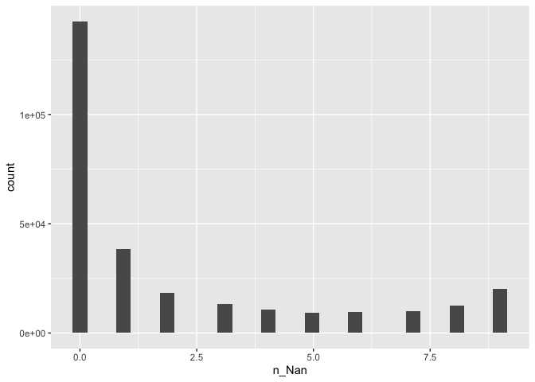

``` r
ggplot(per_cluster_vals) +
  geom_histogram(aes(x=n_0))
```

    `stat_bin()` using `bins = 30`. Pick better value with `binwidth`.

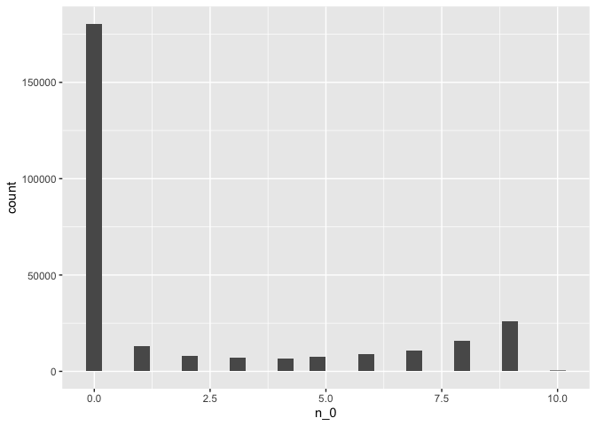

``` r
ggplot(per_cluster_vals) +
  geom_histogram(aes(x=n_1))
```

    `stat_bin()` using `bins = 30`. Pick better value with `binwidth`.

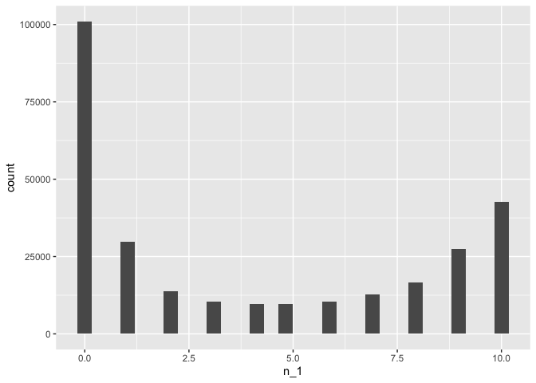

``` r
per_cluster_vals %>%
  pivot_longer(-cluster) %>%
  filter(value != 0) %>%
  ggplot() +
  geom_histogram(aes(x = value,
                     fill = name)) +
  scale_fill_brewer(palette = "Set1") +
  facet_wrap(~name)
```

    `stat_bin()` using `bins = 30`. Pick better value with `binwidth`.

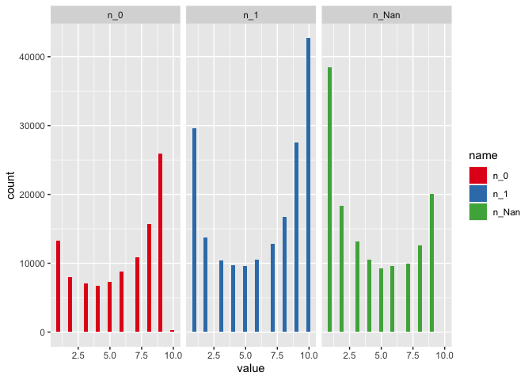

``` r
per_cluster_vals %>%
  pivot_longer(-cluster) %>%
  filter(value != 0) %>%
  ggplot() +
  geom_density(aes(x = value,
                     fill = name)) +
  scale_fill_brewer(palette = "Set1") +
  facet_wrap(~name)
```

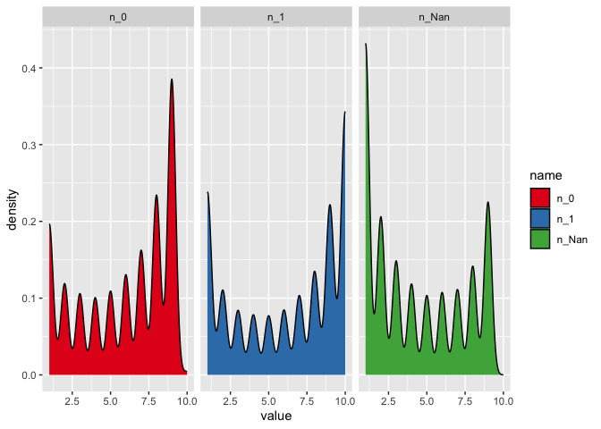

``` r
ggplot(ps_long) +
  geom_histogram(aes(x=value))
```

    `stat_bin()` using `bins = 30`. Pick better value with `binwidth`.

    Warning: Removed 610800 rows containing non-finite values (`stat_bin()`).

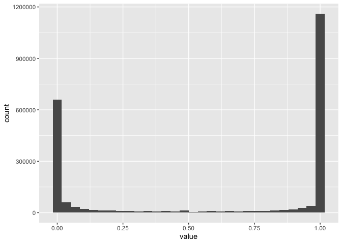

# Analyze ps values for 10k junctions

``` r
ir[1:6,1:6]
```

    Warning: 'xfun::attr()' is deprecated.
    Use 'xfun::attr2()' instead.
    See help("Deprecated")

| Junction | TCGA-62-8402-01A | TCGA-86-8074-01A | TCGA-86-8358-01A | TCGA-86-8056-01A | TCGA-78-7158-01A |
|:---|---:|---:|---:|---:|---:|
| chr10:1000869-1000947:+ | 0.000 | 0.000 | 0 | 0.019 | 0.009 |
| chr10:100190165-100190298:+ | NaN | 1.000 | 1 | 1.000 | 1.000 |
| chr10:100348347-100352365:+ | 0.000 | 0.000 | 0 | 0.014 | 0.000 |
| chr10:100356765-100360733:+ | 0.005 | 0.003 | 0 | 0.006 | 0.000 |
| chr10:100374013-100380982:+ | 0.000 | 0.029 | 0 | 0.067 | 0.000 |
| chr10:100374013-100381215:+ | 0.000 | 0.000 | 0 | 0.000 | 0.017 |

``` r
ir_long <- pivot_longer(ir, -Junction)
head(ir_long)
```

    Warning: 'xfun::attr()' is deprecated.
    Use 'xfun::attr2()' instead.
    See help("Deprecated")

| Junction                | name             | value |
|:------------------------|:-----------------|------:|
| chr10:1000869-1000947:+ | TCGA-62-8402-01A | 0.000 |
| chr10:1000869-1000947:+ | TCGA-86-8074-01A | 0.000 |
| chr10:1000869-1000947:+ | TCGA-86-8358-01A | 0.000 |
| chr10:1000869-1000947:+ | TCGA-86-8056-01A | 0.019 |
| chr10:1000869-1000947:+ | TCGA-78-7158-01A | 0.009 |
| chr10:1000869-1000947:+ | TCGA-49-4507-01A | 0.000 |

``` r
per_jnx_vals <- ir_long %>%
group_by(Junction) %>%
summarize(n_Nan = sum(is.na(value)),
n_0 = sum(value == 0, na.rm = TRUE),
n_1 = sum(value == 1, na.rm = TRUE))

summary(per_jnx_vals$n_Nan)
```

       Min. 1st Qu.  Median    Mean 3rd Qu.    Max. 
     0.0000  0.0000  0.0000  0.9191  1.0000  9.0000 

``` r
summary(per_jnx_vals$n_0)
```

       Min. 1st Qu.  Median    Mean 3rd Qu.    Max. 
      0.000   2.000   5.000   4.411   7.000  10.000 

``` r
summary(per_jnx_vals$n_1)
```

       Min. 1st Qu.  Median    Mean 3rd Qu.    Max. 
     0.0000  0.0000  0.0000  0.3021  0.0000  9.0000 

``` r
ggplot(per_jnx_vals) +
  geom_histogram(aes(x=n_Nan))
```

    `stat_bin()` using `bins = 30`. Pick better value with `binwidth`.

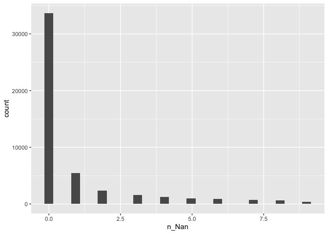

``` r
ggplot(per_jnx_vals) +
  geom_histogram(aes(x=n_0))
```

    `stat_bin()` using `bins = 30`. Pick better value with `binwidth`.

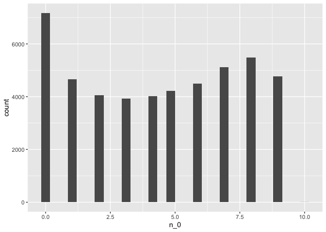

``` r
ggplot(per_jnx_vals) +
  geom_histogram(aes(x=n_1))
```

    `stat_bin()` using `bins = 30`. Pick better value with `binwidth`.

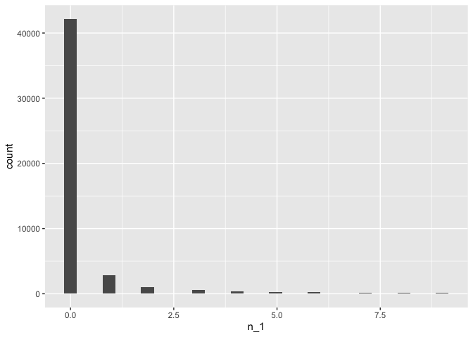

``` r
per_jnx_vals %>%
  pivot_longer(-Junction) %>%
  filter(value != 0) %>%
  ggplot() +
  geom_histogram(aes(x = value,
                     fill = name)) +
  scale_fill_brewer(palette = "Set1") +
  facet_wrap(~name)
```

    `stat_bin()` using `bins = 30`. Pick better value with `binwidth`.

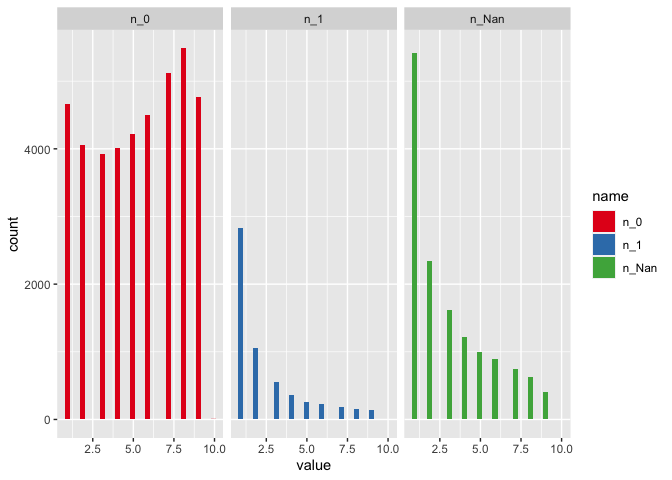

``` r
per_jnx_vals %>%
  pivot_longer(-Junction) %>%
  filter(value != 0) %>%
  ggplot() +
  geom_density(aes(x = value,
                     fill = name)) +
  scale_fill_brewer(palette = "Set1") +
  facet_wrap(~name)
```

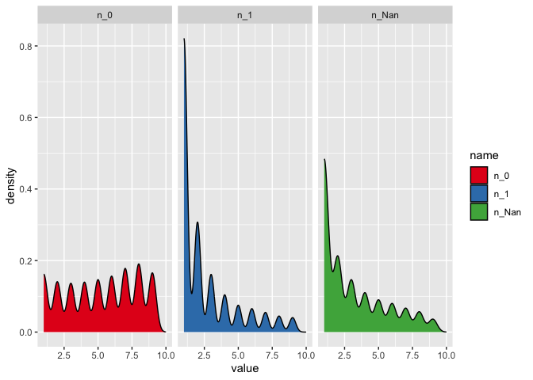
