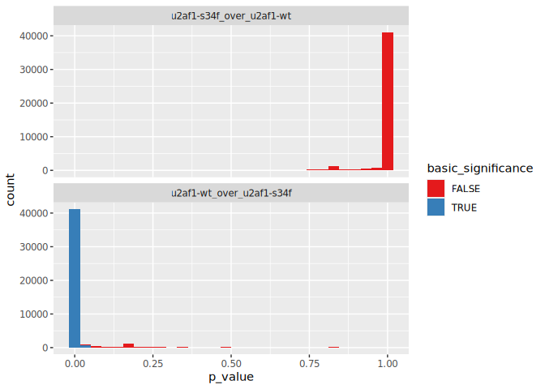
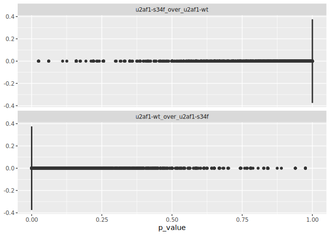
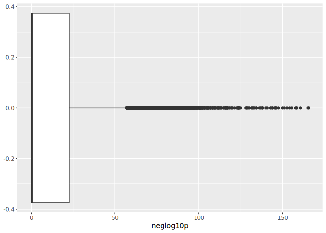
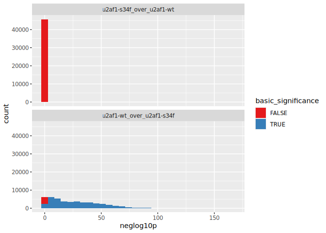

# review results of U2AF1 sig in intropolis 2025.04.29
23.43.54.rmarkdown
Holly Beale
2025-04-30

\#load_libraries

``` r
library(tidyverse)
```

    ── Attaching core tidyverse packages ──────────────────────── tidyverse 2.0.0 ──
    ✔ dplyr     1.1.4     ✔ readr     2.1.5
    ✔ forcats   1.0.0     ✔ stringr   1.5.1
    ✔ ggplot2   3.5.1     ✔ tibble    3.2.1
    ✔ lubridate 1.9.4     ✔ tidyr     1.3.1
    ✔ purrr     1.0.2     
    ── Conflicts ────────────────────────────────────────── tidyverse_conflicts() ──
    ✖ dplyr::filter() masks stats::filter()
    ✖ dplyr::lag()    masks stats::lag()
    ℹ Use the conflicted package (<http://conflicted.r-lib.org/>) to force all conflicts to become errors

``` r
library(janitor)
```


    Attaching package: 'janitor'

    The following objects are masked from 'package:stats':

        chisq.test, fisher.test

# Previous findings for comparison

from splicedice manuscript draft: Of the 48,837 samples that we tested,
only 22 were significant matches to the U2AF1-S34F signature.

# Load data

``` r
results_file <- "/mnt/output/splicedice_U2AF1_sig_in_intropolis_2025.04.29_23.43.54//U2AF1_sig_in_intropolis.pvals.tsv"

results <- read_tsv(results_file)
```

    Rows: 2 Columns: 48838
    ── Column specification ────────────────────────────────────────────────────────
    Delimiter: "\t"
    chr     (1): query
    dbl (48837): 0, 1, 2, 4, 5, 6, 7, 8, 9, 10, 11, 12, 13, 14, 15, 16, 17, 18, ...

    ℹ Use `spec()` to retrieve the full column specification for this data.
    ℹ Specify the column types or set `show_col_types = FALSE` to quiet this message.

data features

``` r
system(paste("md5sum", results_file), intern = TRUE)
```

    [1] "2db2cfd3b5eb25ddae25e5b3d8b0ebb0  /mnt/output/splicedice_U2AF1_sig_in_intropolis_2025.04.29_23.43.54//U2AF1_sig_in_intropolis.pvals.tsv"

``` r
dim(results)
```

    [1]     2 48838

The number of samples in this results file: 48,837

# pivot for managability

``` r
results_long <- results %>%
  pivot_longer (-query, names_to = "SRA_dataset", values_to = "p_value") %>%
  mutate(neglog10p = -log10(p_value),
         basic_significance = p_value < 0.05,
         bonf_significance = p_value/(ncol(results)-1) < -0.05)
```

# Exclude NA data

``` r
results_long_NA_annotated <- results_long %>%
  group_by(SRA_dataset) %>%
  mutate(two_NAs = all(is.na(p_value))) 

results_long_NA_annotated %>%
  filter(two_NAs) %>%
  arrange(SRA_dataset) %>%
  head
```

| query | SRA_dataset | p_value | neglog10p | basic_significance | bonf_significance | two_NAs |
|:---|:---|---:|---:|:---|:---|:---|
| u2af1-wt_over_u2af1-s34f | 1000 | NaN | NaN | NA | NA | TRUE |
| u2af1-s34f_over_u2af1-wt | 1000 | NaN | NaN | NA | NA | TRUE |
| u2af1-wt_over_u2af1-s34f | 10000 | NaN | NaN | NA | NA | TRUE |
| u2af1-s34f_over_u2af1-wt | 10000 | NaN | NaN | NA | NA | TRUE |
| u2af1-wt_over_u2af1-s34f | 10001 | NaN | NaN | NA | NA | TRUE |
| u2af1-s34f_over_u2af1-wt | 10001 | NaN | NaN | NA | NA | TRUE |

``` r
results_long_NA_excluded <- results_long_NA_annotated %>%
  filter(!two_NAs)
```

# survey of results

``` r
summary(results_long_NA_excluded$p_value)
```

       Min. 1st Qu.  Median    Mean 3rd Qu.    Max. 
        0.0     0.0     0.5     0.5     1.0     1.0 

``` r
tabyl(results_long_NA_excluded,
      query,
      basic_significance)
```

| query                    | FALSE |  TRUE |
|:-------------------------|------:|------:|
| u2af1-s34f_over_u2af1-wt | 45734 |    10 |
| u2af1-wt_over_u2af1-s34f |  3815 | 41929 |

``` r
tabyl(results_long_NA_excluded,
      query,
      basic_significance) %>%
  adorn_percentages() %>%
  adorn_pct_formatting(digits = 2)
```

| query                    | FALSE  | TRUE   |
|:-------------------------|:-------|:-------|
| u2af1-s34f_over_u2af1-wt | 99.98% | 0.02%  |
| u2af1-wt_over_u2af1-s34f | 8.34%  | 91.66% |

## bonf_significance

I calculated bonf_significance in case the p values were not already
adjusted for multiple testing; no values exceed it

``` r
tabyl(results_long_NA_excluded,
                 bonf_significance)
```

| bonf_significance |     n | percent |
|:------------------|------:|--------:|
| FALSE             | 91488 |       1 |

# Show the significant results

``` r
results_long_NA_excluded %>%
  filter(query == "u2af1-s34f_over_u2af1-wt",
         basic_significance)
```

| query | SRA_dataset | p_value | neglog10p | basic_significance | bonf_significance | two_NAs |
|:---|:---|---:|---:|:---|:---|:---|
| u2af1-s34f_over_u2af1-wt | 266 | 0.0247673 | 1.606121 | TRUE | FALSE | FALSE |
| u2af1-s34f_over_u2af1-wt | 2161 | 0.0247673 | 1.606121 | TRUE | FALSE | FALSE |
| u2af1-s34f_over_u2af1-wt | 10156 | 0.0247673 | 1.606121 | TRUE | FALSE | FALSE |
| u2af1-s34f_over_u2af1-wt | 12821 | 0.0247673 | 1.606121 | TRUE | FALSE | FALSE |
| u2af1-s34f_over_u2af1-wt | 23810 | 0.0247673 | 1.606121 | TRUE | FALSE | FALSE |
| u2af1-s34f_over_u2af1-wt | 39250 | 0.0247673 | 1.606121 | TRUE | FALSE | FALSE |
| u2af1-s34f_over_u2af1-wt | 41724 | 0.0247673 | 1.606121 | TRUE | FALSE | FALSE |
| u2af1-s34f_over_u2af1-wt | 42795 | 0.0247673 | 1.606121 | TRUE | FALSE | FALSE |
| u2af1-s34f_over_u2af1-wt | 43342 | 0.0247673 | 1.606121 | TRUE | FALSE | FALSE |
| u2af1-s34f_over_u2af1-wt | 48364 | 0.0247673 | 1.606121 | TRUE | FALSE | FALSE |

All significant results have the same p-value. Weird. Look at all
samples with that p-value 26 additional samples have that p-value. Those
are wt/mutant, not mutant/wt

``` r
results_long_NA_excluded %>%
  filter(p_value > 0.02476730,
         p_value < 0.02476732)
```

| query | SRA_dataset | p_value | neglog10p | basic_significance | bonf_significance | two_NAs |
|:---|:---|---:|---:|:---|:---|:---|
| u2af1-wt_over_u2af1-s34f | 1308 | 0.0247673 | 1.606121 | TRUE | FALSE | FALSE |
| u2af1-wt_over_u2af1-s34f | 1704 | 0.0247673 | 1.606121 | TRUE | FALSE | FALSE |
| u2af1-wt_over_u2af1-s34f | 1812 | 0.0247673 | 1.606121 | TRUE | FALSE | FALSE |
| u2af1-wt_over_u2af1-s34f | 2348 | 0.0247673 | 1.606121 | TRUE | FALSE | FALSE |
| u2af1-wt_over_u2af1-s34f | 2771 | 0.0247673 | 1.606121 | TRUE | FALSE | FALSE |
| u2af1-wt_over_u2af1-s34f | 2991 | 0.0247673 | 1.606121 | TRUE | FALSE | FALSE |
| u2af1-wt_over_u2af1-s34f | 9798 | 0.0247673 | 1.606121 | TRUE | FALSE | FALSE |
| u2af1-wt_over_u2af1-s34f | 9811 | 0.0247673 | 1.606121 | TRUE | FALSE | FALSE |
| u2af1-wt_over_u2af1-s34f | 14025 | 0.0247673 | 1.606121 | TRUE | FALSE | FALSE |
| u2af1-wt_over_u2af1-s34f | 15787 | 0.0247673 | 1.606121 | TRUE | FALSE | FALSE |
| u2af1-wt_over_u2af1-s34f | 17015 | 0.0247673 | 1.606121 | TRUE | FALSE | FALSE |
| u2af1-wt_over_u2af1-s34f | 18021 | 0.0247673 | 1.606121 | TRUE | FALSE | FALSE |
| u2af1-wt_over_u2af1-s34f | 21808 | 0.0247673 | 1.606121 | TRUE | FALSE | FALSE |
| u2af1-wt_over_u2af1-s34f | 24305 | 0.0247673 | 1.606121 | TRUE | FALSE | FALSE |
| u2af1-wt_over_u2af1-s34f | 25535 | 0.0247673 | 1.606121 | TRUE | FALSE | FALSE |
| u2af1-wt_over_u2af1-s34f | 27030 | 0.0247673 | 1.606121 | TRUE | FALSE | FALSE |
| u2af1-wt_over_u2af1-s34f | 28925 | 0.0247673 | 1.606121 | TRUE | FALSE | FALSE |
| u2af1-wt_over_u2af1-s34f | 33034 | 0.0247673 | 1.606121 | TRUE | FALSE | FALSE |
| u2af1-wt_over_u2af1-s34f | 36351 | 0.0247673 | 1.606121 | TRUE | FALSE | FALSE |
| u2af1-wt_over_u2af1-s34f | 39036 | 0.0247673 | 1.606121 | TRUE | FALSE | FALSE |
| u2af1-wt_over_u2af1-s34f | 39037 | 0.0247673 | 1.606121 | TRUE | FALSE | FALSE |
| u2af1-wt_over_u2af1-s34f | 39402 | 0.0247673 | 1.606121 | TRUE | FALSE | FALSE |
| u2af1-wt_over_u2af1-s34f | 42579 | 0.0247673 | 1.606121 | TRUE | FALSE | FALSE |
| u2af1-wt_over_u2af1-s34f | 43893 | 0.0247673 | 1.606121 | TRUE | FALSE | FALSE |
| u2af1-wt_over_u2af1-s34f | 47568 | 0.0247673 | 1.606121 | TRUE | FALSE | FALSE |
| u2af1-wt_over_u2af1-s34f | 49417 | 0.0247673 | 1.606121 | TRUE | FALSE | FALSE |
| u2af1-s34f_over_u2af1-wt | 266 | 0.0247673 | 1.606121 | TRUE | FALSE | FALSE |
| u2af1-s34f_over_u2af1-wt | 2161 | 0.0247673 | 1.606121 | TRUE | FALSE | FALSE |
| u2af1-s34f_over_u2af1-wt | 10156 | 0.0247673 | 1.606121 | TRUE | FALSE | FALSE |
| u2af1-s34f_over_u2af1-wt | 12821 | 0.0247673 | 1.606121 | TRUE | FALSE | FALSE |
| u2af1-s34f_over_u2af1-wt | 23810 | 0.0247673 | 1.606121 | TRUE | FALSE | FALSE |
| u2af1-s34f_over_u2af1-wt | 39250 | 0.0247673 | 1.606121 | TRUE | FALSE | FALSE |
| u2af1-s34f_over_u2af1-wt | 41724 | 0.0247673 | 1.606121 | TRUE | FALSE | FALSE |
| u2af1-s34f_over_u2af1-wt | 42795 | 0.0247673 | 1.606121 | TRUE | FALSE | FALSE |
| u2af1-s34f_over_u2af1-wt | 43342 | 0.0247673 | 1.606121 | TRUE | FALSE | FALSE |
| u2af1-s34f_over_u2af1-wt | 48364 | 0.0247673 | 1.606121 | TRUE | FALSE | FALSE |

# visualize distribution of p values

histogram

``` r
ggplot(results_long_NA_excluded) + 
  geom_histogram(aes(x=p_value, fill = basic_significance)) +
  scale_fill_brewer(palette = "Set1") +
  facet_wrap(~query, ncol = 1)
```

    `stat_bin()` using `bins = 30`. Pick better value with `binwidth`.



``` r
ggplot(results_long_NA_excluded) + 
  geom_boxplot(aes(x=p_value))  +
  facet_wrap(~query, ncol = 1)
```



# Review -log10(p value)

boxplot

``` r
ggplot(results_long_NA_excluded) + 
  geom_boxplot(aes(x=neglog10p)) +
  scale_fill_brewer(palette = "Set1")
```



histogram

``` r
ggplot(results_long_NA_excluded) + 
  geom_histogram(aes(x=neglog10p, fill = basic_significance)) +
  scale_fill_brewer(palette = "Set1") +
  facet_wrap(~query, ncol = 1)
```

    `stat_bin()` using `bins = 30`. Pick better value with `binwidth`.



Conclusion Here we find 10 significant matches to the u2af1 signature
(assuming a p-value \< 0.05 in the u2af1-s34f_over_u2af1-wt query means
the same thing Dennis means when he says “significant matches to the
U2AF1-S34F signature”).

If we want to pursue this, if we can find the key to connect intropolis
IDs (e.g. 1-48000) to SRA IDs, we could check if we see what Dennis saw,
the u2af1-s34f mutation in the SRA data.
